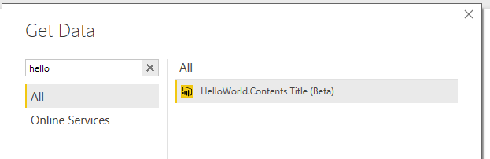
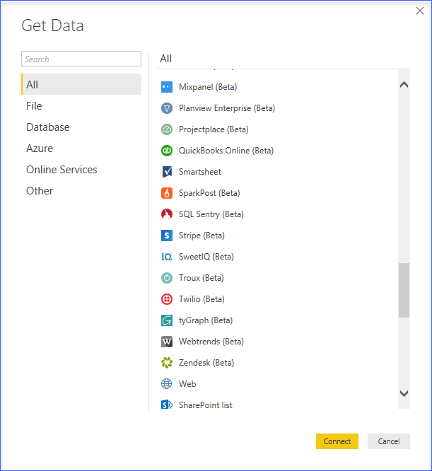

> **Update 10/18/2022**: A new version of the Power Query SDK has been released and is currently in Public Preview. We welcome you to try out this new SDK from the Visual Studio Code Marketplace and provide feedback, report bugs and share suggestions around this new SDK. All future investments in regards to the Power Query SDK will go towards the new SDK. 
> You can also join the new discussions section in the new Power Query SDK GitHub repository where you can interact with other members of the community and ask questions around the development of custom connectors. Below you'll find a list with all the links to the resources of the new Power Query SDK
>
> * [New Power Query SDK extension for Visual Studio Code](https://aka.ms/PowerQuerySDK)
> * [GitHub repository for the new Power Query SDK](https://github.com/Microsoft/vscode-powerquery-sd)
> * [Quickstart guide for the new Power Query SDK in Visual Studio Code](https://aka.ms/PowerQuerySDKDocs)

# Getting Started with Data Connectors

Data Connectors for Power BI enables users to connect to and access data from your application, service, or data source, providing them with rich business intelligence and robust analytics over multiple data sources. By integrating seamlessly into the Power Query connectivity experience in Power BI Desktop, Data Connectors make it easy for power users to query, shape and mashup data from your app to build reports and dashboards that meet the needs of their organization.

Data Connectors are created using the [M language](https://docs.microsoft.com/powerquery-m/power-query-m-language-specification). This is the same language used by the Power Query user experience found in Power BI Desktop and Excel 2016. Extensions allow you to define new functions for the M language, and can be used to enable connectivity to new data sources. While this document will focus on defining new connectors, much of the same process applies to defining general purpose M functions. Extensions can vary in complexity, from simple wrappers that essentially just provide "branding" over existing data source functions, to rich connectors that support Direct Query.

Please see the [Power Query Connector Developer Reference](https://docs.microsoft.com/power-query/handlingauthentication) for more details.

## Quickstart

1. Install the [Power Query SDK](https://aka.ms/powerquerysdk) from the Visual Studio Marketplace
2. Create a new Data Connector project
3. Define your connector logic
4. Build the project to produce an extension file
5. Copy the extension file into the `[Documents]\Power BI Desktop\Custom Connectors` directory
6. Open Power BI Desktop

Note, to load extensions during development, you will need to lower the security level for extensions in Power BI Desktop to enable loading unsigned/uncertified connectors.

1. Go to File | Options and settings | Options
2. Go the Security tab
3. Under *Data Extensions*, select *Allow any extension to load without warning or validation*
4. Restart Power BI Desktop

## Gateway Support

The Power BI On-Premises Gateway now supports loading custom connectors.
Please see the [technical documentation](https://docs.microsoft.com/power-query/handlinggatewaysupport) for more information, and the [TripPin Sample](https://docs.microsoft.com/power-query/samples/trippin/readme) for an example of how to add gateway support to your connector.

## Distribution of Data Connectors

Power BI Desktop users can download extension files and place them in a known directory (steps described above). Power BI Desktop will automatically load the extensions on restart.

Please see the [Connector Certification](https://docs.microsoft.com/power-query/connectorcertification) documentation
for details on the certification process and requirements.

## Additional Links and Resources

* [Data Connector Technical Reference](https://docs.microsoft.com/power-query/handlingdataaccess)
* [M Library Functions](https://docs.microsoft.com/powerquery-m/power-query-m-function-reference)
* [M Language Specification](https://docs.microsoft.com/powerquery-m/power-query-m-language-specification)
* [Power BI Developer Center](https://powerbi.microsoft.com/developers/)
* [Data Connector Samples](https://docs.microsoft.com/power-query/samplesdirectory)

The recording of the [Creating a Custom Data Connector session](https://www.youtube.com/watch?v=ecfRTEoYadI) from the [Microsoft Data Insights Summit 2017](https://powerbi.microsoft.com/blog/microsoft-data-insights-summit-2017-day-1-recap/) can be found by clicking the image below:

## Hello World Sample

The following code sample defines a simple "Hello World" data source. See the [full sample](samples/HelloWorld) for more information.

<pre style="font-family:Consolas;font-size:13;color:black;background:white;">section&nbsp;HelloWorld;
 
[DataSource.Kind=&quot;HelloWorld&quot;,&nbsp;Publish=&quot;HelloWorld.Publish&quot;]
shared&nbsp;HelloWorld.Contents&nbsp;=&nbsp;(optional&nbsp;message&nbsp;as&nbsp;text)&nbsp;=&gt;
&nbsp;&nbsp;&nbsp;&nbsp;let
&nbsp;&nbsp;&nbsp;&nbsp;&nbsp;&nbsp;&nbsp;&nbsp;message&nbsp;=&nbsp;if&nbsp;(message&nbsp;&lt;&gt;&nbsp;null)&nbsp;then&nbsp;message&nbsp;else&nbsp;&quot;Hello&nbsp;world&quot;
&nbsp;&nbsp;&nbsp;&nbsp;in
&nbsp;&nbsp;&nbsp;&nbsp;&nbsp;&nbsp;&nbsp;&nbsp;message;
 
HelloWorld&nbsp;=&nbsp;[
&nbsp;&nbsp;&nbsp;&nbsp;Authentication&nbsp;=&nbsp;[
&nbsp;&nbsp;&nbsp;&nbsp;&nbsp;&nbsp;&nbsp;&nbsp;Implicit&nbsp;=&nbsp;[]
&nbsp;&nbsp;&nbsp;&nbsp;],
&nbsp;&nbsp;&nbsp;&nbsp;Label&nbsp;=&nbsp;Extension.LoadString(&quot;DataSourceLabel&quot;)
];
 
HelloWorld.Publish&nbsp;=&nbsp;[
&nbsp;&nbsp;&nbsp;&nbsp;Beta&nbsp;=&nbsp;true,
&nbsp;&nbsp;&nbsp;&nbsp;ButtonText&nbsp;=&nbsp;{&nbsp;Extension.LoadString(&quot;FormulaTitle&quot;),&nbsp;Extension.LoadString(&quot;FormulaHelp&quot;)&nbsp;},
&nbsp;&nbsp;&nbsp;&nbsp;SourceImage&nbsp;=&nbsp;HelloWorld.Icons,
&nbsp;&nbsp;&nbsp;&nbsp;SourceTypeImage&nbsp;=&nbsp;HelloWorld.Icons
];
 
HelloWorld.Icons&nbsp;=&nbsp;[
&nbsp;&nbsp;&nbsp;&nbsp;Icon16&nbsp;=&nbsp;{&nbsp;Extension.Contents(&quot;HelloWorld16.png&quot;),&nbsp;Extension.Contents(&quot;HelloWorld20.png&quot;),&nbsp;Extension.Contents(&quot;HelloWorld24.png&quot;),&nbsp;Extension.Contents(&quot;HelloWorld32.png&quot;)&nbsp;},
&nbsp;&nbsp;&nbsp;&nbsp;Icon32&nbsp;=&nbsp;{&nbsp;Extension.Contents(&quot;HelloWorld32.png&quot;),&nbsp;Extension.Contents(&quot;HelloWorld40.png&quot;),&nbsp;Extension.Contents(&quot;HelloWorld48.png&quot;),&nbsp;Extension.Contents(&quot;HelloWorld64.png&quot;)&nbsp;}
];
</pre>

## What You Can Do With a Data Connector

Data Connectors allow you to create new data sources, or customize and extend an existing source. Common use cases include:

* Creating a business analyst friendly view for a REST API
* Providing branding for a source that Power Query supports with an existing connector (such as an OData service, or ODBC driver)
* Implementing an OAuth v2 authentication flow for a SaaS offering
* Exposing a limited/filtered view over your data source to improve usability
* Supporting different authentication modes when creating a [Power BI Content Pack](https://powerbi.microsoft.com/documentation/powerbi-developer-content-pack-overview/)
* Enabling Direct Query for a data source via an ODBC driver
