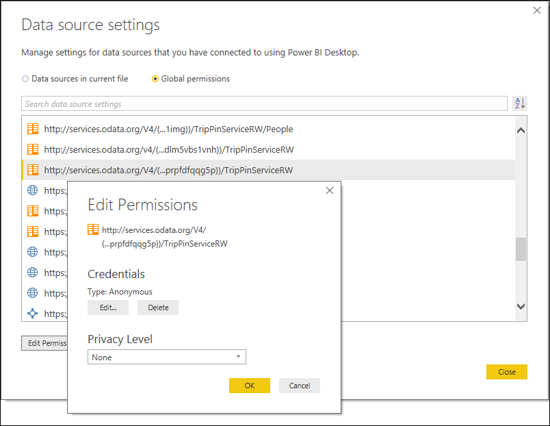
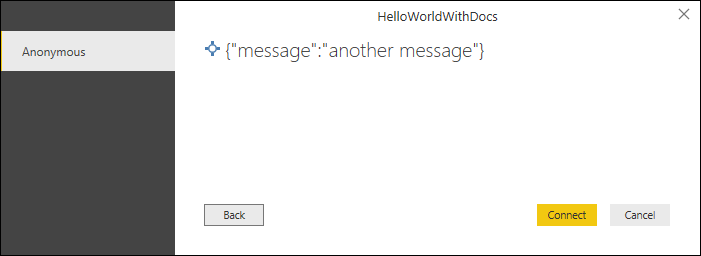
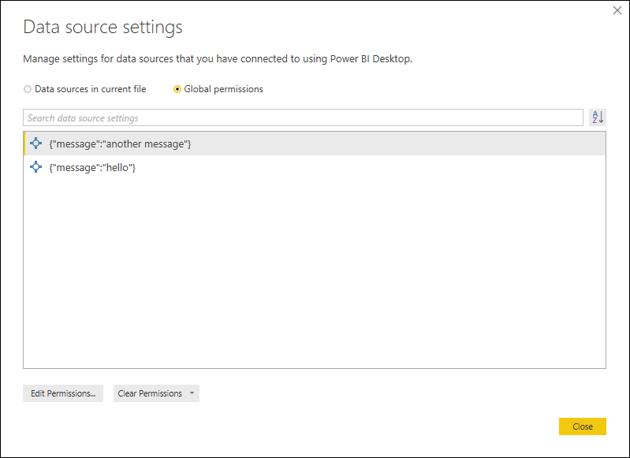
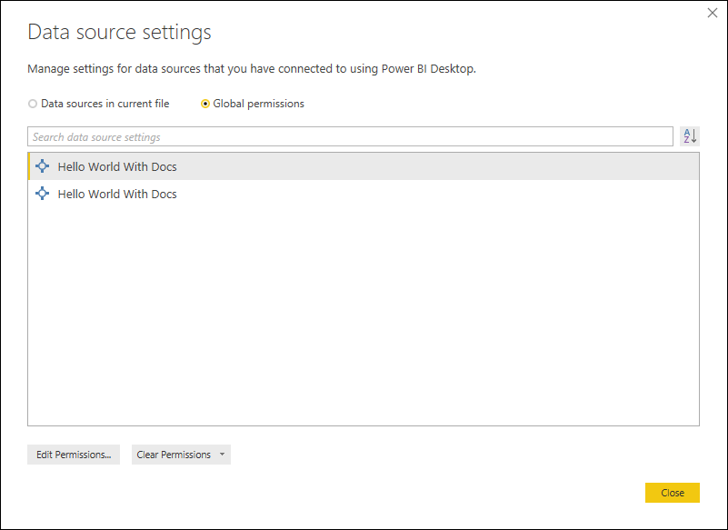
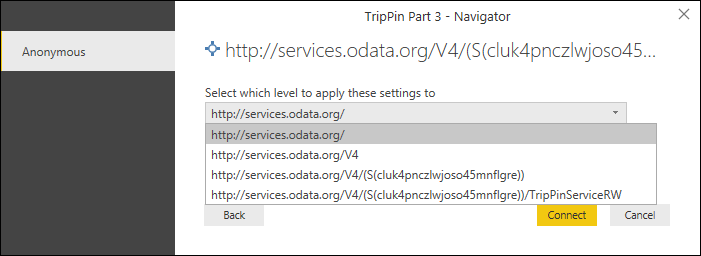

# M Extensions

**Table of Contents**
* [1 - Overview](#overview)
  * [1.1 - Additional Resources](#additional-resources)
  * [1.2 - Developer Tools](#developer-tools)
  * [1.3 - Extension Files](#extension-files)
  * [1.4 - Extension File Format](#extension-file-format)
  * [1.5 - Query File](#query-file)
* [2 - Power Query SDK](#power-query-sdk)
  * [2.1 - Creating a Data Connector in Visual Studio](#creating-a-new-extension-in-visual-studio)
  * [2.2 - Testing in Visual Studio](#testing-in-visual-studio)
  * [2.3 - Build and Deploy from Visual Studio](#build-and-deploy-from-visual-studio)
* [3 - Technical Reference](#technical-reference)
  * [3.1 - Data Source Kind](#data-source-kind)
  * [3.2 - Publish to UI](#publish-to-ui)
  * [3.3 - Data Source Functions](#data-source-functions)
  * [3.4 - Authentication and Credentials](#authentication-and-credentials)
  * [3.5 - Data Source Paths](#data-source-paths)
* [4 - Next Steps](#next-steps)

## Overview

Power BI extensions are created using M (also known as the Power Query Formula Language). This is the same language used by the Power Query (PQ) user experience found in Power BI Desktop (PBID) and Excel 2016. Extensions allow you to define new functions for the M language, and can be used to enable connectivity to new data sources. While this document will focus on defining new connectors, much of the same process applies to defining general purpose M functions. Extensions can vary in complexity, from simple wrappers that essentially just provide "branding" over existing data source functions, to rich connectors that support Direct Query (DQ).

The general process is:
1. Install the [Power Query SDK](https://aka.ms/powerquerysdk) from the Visual Studio Marketplace
2. Create a new Data Connector project
3. Define your connector logic
4. Build the project to produce an extension file
5. Create a `C:\Program Files\Microsoft Power BI Desktop\bin\extensions` directory
6. Create a `PQ_ExtensionDirectory` environment variable, set its value to this directory
7. Copy the extension file into this directory
8. Restart Power BI Desktop

> **Note:** Setting the environment variable (Step 5) is temporary. Extensibility can be enabled as a Preview Feature in Power BI Desktop starting the June release. Also note that starting in the June release, the default file extension will be changed to .pqx.

We are currently working on enabling a central marketplace/distribution mechanism for Data Connectors. In the meantime, ISVs interested in distributing their connectors with Power BI Desktop can contact DataConnectors@microsoft.com.

### Additional Resources

* [M Library Functions](https://msdn.microsoft.com/library/mt253322.aspx)
* [M Language Specification](https://msdn.microsoft.com/library/mt807488.aspx)
* [Power BI Developer Center](https://powerbi.microsoft.com/developers/)

### Developer Tools

The following tools are recommended for developing PQ extensions.

| Tool                              | Description                                                                                                                                   | Location                                                   |
|:----------------------------------|:----------------------------------------------------------------------------------------------------------------------------------------------|:-----------------------------------------------------------|
| Power Query SDK for Visual Studio | Visual studio extension (vsix) which provides the Data Connector Project templates, as well as syntax highlighting, intellisense, and build capabilities.  | [Download](https://aka.ms/powerquerysdk)      |
| Power BI Desktop                  | Used to visually build M expressions and test out your data source extension.                                                                 | [Download](https://powerbi.microsoft.com/desktop/)         |

## Power Query SDK

### Creating a New Extension in Visual Studio

Installing the Power Query SDK for Visual Studio will create a new Data Connector project template in Visual Studio.


This creates a new project containing the following files:
1. Connector definition file (&lt;connectorName&gt;.pq)
2. A query test file (&lt;connectorName&gt;.query.pq)
3. A string resource file (resources.resx)
4. PNG files of various sizes used to create icons

Your connector definition file will start with an empty Data Source description. Please see the [Data Source Kind](#data-source-kind) section later in this document for details.

### Testing in Visual Studio

The Power Query SDK provides basic query execution capabilities, allowing you to test your extension without having to switch over to Power BI Desktop. See the [Query File](#query-file) section for more details.

### Build and Deploy from Visual Studio

Building your project will produce your .pqx file.

Data Connector projects do not support custom post build steps to copy the extension file to your `PQ_ExtensionDirectory`. If this is something you want to do, you may want to use a third party visual studio extension, such as [Auto Deploy](https://visualstudiogallery.msdn.microsoft.com/9f7165ab-eef6-4576-8733-b630db1a59c0?SRC=VSIDE).

### Extension Files

PQ extensions are bundled in a zip file and given a .mez file extension.
At runtime, PBI Desktop will load extensions from directory defined by the `PQ_ExtensionDirectory` environment variable.

> **Note:** in an upcoming change the default extension will be changed from .mez to .pqx

### Extension File Format

Extensions are defined within an M section document. A section document has a slightly different format from the query document(s) generated in Power Query. Code you import from Power Query typically requires modification to fit into a section document, but the changes are minor. Section document differences you should be aware of include:

* They begin with a section declaration (ex. `section HelloWorld;`)
* Each expression ends with a semi-colon (ex. `a = 1;` or `b = let c = 1 + 2 in c;`)
* All functions and variables are local to the section document, unless they are marked as `shared`. Shared functions become visible to other queries/functions, and can be thought of as the _exports_ for your extension (i.e. they become callable from Power Query).

More information about M section documents can be found in the [M Language specification](https://msdn.microsoft.com/library/mt807488.aspx).

### Query File

In addition to the [extension file](#extension-file-format), Data Connector projects can have a Query file (&lt;name&gt;.query.pq). This file can be used to run test queries within Visual Studio. The query evaluation will automatically include your extension code, without having to register your .pqx file, allowing you to call/test any `shared` functions in your extension code. 

The query file can contain a single expression (ex. `HelloWorld.Contents()`), a let expression (such as what Power Query would generate), or a section document. 

## Technical Reference

### Data Source Functions

A Data Connector wraps and customizes the behavior of a [data source function in the M Library](https://msdn.microsoft.com/library/mt253322.aspx#Anchor_15).
For example, an extension for a REST API would make use of the [Web.Contents](https://msdn.microsoft.com/library/mt260892.aspx) function to make HTTP requests.
Currently, a limited set of data source functions have been enabled to support extensibility.

- [Web.Contents](https://msdn.microsoft.com/library/mt260892.aspx)
- [OData.Feed](https://msdn.microsoft.com/library/mt260868.aspx)
- [Odbc.DataSource](https://msdn.microsoft.com/library/mt708843.aspx)
- [AdoDotNet.DataSource](https://msdn.microsoft.com/library/mt736964)
- [OleDb.DataSource](https://msdn.microsoft.com/library/mt790573.aspx)

**Example:**

```
[DataSource.Kind="HelloWorld", Publish="HelloWorld.Publish"]
shared HelloWorld.Contents = (optional message as text) =>
    let
        message = if (message <> null) then message else "Hello world"
    in
        message;
```

### Data Source Kind

Functions marked as `shared` in your extension can be associated with a specific data source by including a `DataSource.Kind` metadata record on the function with the name of a Data Source definition record. 
The Data Source record defines the authentication types supported by your data source, and basic branding information (like the display name / label).
The name of the record becomes is unique identifier. 

Functions associated with a data source must have the same required function parameters (including name, type, and order). Functions for a specific Data Source Kind can only use credentials associated with that Kind.
Credentials are identified at runtime by performing a lookup based on the combination of the function's required parameters.
For more information about how credentials are identified, please see [Data Source Paths] below.

**Example:**

```
HelloWorld = [
    Authentication = [
        Implicit = []
    ],
    Label = Extension.LoadString("DataSourceLabel")
];
```

#### Properties

The following table lists the fields for your Data Source definition record.

| Field              | Type     | Details                                                                                                                                                                                                                                                                   |
|:-------------------|:---------|:--------------------------------------------------------------------------------------------------------------------------------------------------------------------------------------------------------------------------------------------------------------------------|
| Authentication     | record   | Specifies one or more types of authentication supported by your data source. At least one kind is required. Each kind will be displayed as an option in the Power Query credential prompt. For more information, see [Authentication Kinds](#authentication-kinds) below. |
| Label              | text     | **(optional)** Friendly display name for this extension in credential dialogs.                                                                                                                                                                                            |
| SupportsEncryption | logical  | **(optional)** When true, the UI will present the option to connect to the data source using an encrypted connection. This is typically used for data sources with a non-encrypted fallback mechanism (generally ODBC or ADO.NET based sources).                          |

### Publish to UI

Similar to the (Data Source)[#data-source-kind] definition record, the Publish record provides the Power Query UI the information it needs to expose this extension in the Get Data dialog.

**Example:**

```
HelloWorld.Publish = [
    Beta = true,
    ButtonText = { Extension.LoadString("FormulaTitle"), Extension.LoadString("FormulaHelp") },
    SourceImage = HelloWorld.Icons,
    SourceTypeImage = HelloWorld.Icons
];

HelloWorld.Icons = [
    Icon16 = { Extension.Contents("HelloWorld16.png"), Extension.Contents("HelloWorld20.png"), Extension.Contents("HelloWorld24.png"), Extension.Contents("HelloWorld32.png") },
    Icon32 = { Extension.Contents("HelloWorld32.png"), Extension.Contents("HelloWorld40.png"), Extension.Contents("HelloWorld48.png"), Extension.Contents("HelloWorld64.png") }
];
```

#### Properties

The following table lists the fields for your Publish record.

| Field               | Type    | Details                                                                                                                                                                                                                                                                                                                    |
|:--------------------|:--------|:---------------------------------------------------------------------------------------------------------------------------------------------------------------------------------------------------------------------------------------------------------------------------------------------------------------------------|
| ButtonText          | list    | List of text items that will be displayed next to the data source's icon in the Power BI Get Data dialog.                                                                                                                                                                                                                  |
| Category            | text    | Where the extension should be displayed in the Get Data dialog. Currently the only category values with special handing are `Azure` and `Database`. All other values will end up under the Other category.                                                                                                               |
| Beta                | logical | **(optional)** When set to true, the UI will display a Preview/Beta identifier next to your connector name and a warning dialog that the implementation of the connector is subject to breaking changes.                                                                                                                   |
| LearnMoreUrl        | text    | **(optional)** Url to website containing more information about this data source or connector.                                                                                                                                                                                                                             |
| SupportsDirectQuery | logical | **(optional)** Enables Direct Query for your extension.<br>**This is currently only supported for ODBC extensions.**                                                                                                                                                                                                       |
| SourceImage         | record  | **(optional)** A record containing a list of binary images (sourced from the extension file using the **Extension.Contents** method). The record contains two fields (Icon16, Icon32), each with its own list. Each icon should be a different size.                                                                       |                                                                                                                                                                                                                              |
| SourceTypeImage     | record  | **(optional)** Similar to SourceImage, except the convention for many out of the box connectors is to display a sheet icon with the source specific icon in the bottom right corner. Having a different set of icons for SourceTypeImage is optional - many extensions simply reuse the same set of icons for both fields. |

### Authentication and Credentials

#### Authentication Kinds

An extension can support one or more kinds of Authentication. Each authentication kind is a different type of credential. The authentication UI displayed to end users in Power Query is driven by the type of credential(s) that an extension supports.

The list of supported authentication types is defined as part of an extension's [Data Source Kind](#data-source-kind) definition. Each Authentication value is a record with specific fields. The table below lists the expected fields for each kind. All fields are required unless marked otherwise.

| Authentication Kind | Field         | Description                                                                                                                 |
|:--------------------|:--------------|:----------------------------------------------------------------------------------------------------------------------------|
| Implicit            |               | The Implicit (anonymous) authentication kind does not have any fields.                                                      |
| OAuth               | StartLogin    | Function which provides the URL and state information for initiating an OAuth flow.<br><br>See [Implementing an OAuth Flow](#implementing-an-oauth-flow) below.|
|                     | FinishLogin   | Function which extracts the access\_token and other properties related to the OAuth flow.                                   |
|                     | Refresh       | **(optional)** Function that retrieves a new access token from a refresh token.                                             |
|                     | Logout        | **(optional)** Function that invalidates the user's current access token.                                                   |
|                     | Label         | **(optional)** A text value that allows you to override the default label for this AuthenticationKind.                      |
| UsernamePassword    | UsernameLabel | **(optional)** A text value to replace the default label for the *Username* text box on the credentials UI.                 |
|                     | PasswordLabel | **(optional)** A text value to replace the default label for the *Password* text box on the credentials UI.                 |
|                     | Label         | **(optional)** A text value that allows you to override the default label for this AuthenticationKind.                      |
| Windows             | UsernameLabel | **(optional)** A text value to replace the default label for the *Username* text box on the credentials UI.                 |
|                     | PasswordLabel | **(optional)** A text value to replace the default label for the *Password* text box on the credentials UI.                 |
|                     | Label         | **(optional)** A text value that allows you to override the default label for this AuthenticationKind.                      |
| Key                 | KeyLabel      | **(optional)** A text value to replace the default label for the *API Key* text box on the credentials UI.                  |
|                     | Label         | **(optional)** A text value that allows you to override the default label for this AuthenticationKind.                      |

The sample below shows the Authentication record for a connector that supports OAuth, Key, Windows, Basic (Username and Password), and anonymous credentials.

**Example:**

```
Authentication = [
    OAuth = [
        StartLogin = StartLogin,
        FinishLogin = FinishLogin,
        Refresh = Refresh,
        Logout = Logout
    ],
    Key = [],
    UsernamePassword = [],
    Windows = [],
    Implicit = []
]
```

#### Accessing the Current Credentials

The current credentials can be retrieved using the `Extension.CurrentCredential()` function.

M data source functions that have been enabled for extensibility will automatically inherit your extension's credential scope. In most cases, you will not need to explicitly access the current credentials, however, there are exceptions, such as:

* Passing in the credential in a custom header or query string parameter (such as when you are using the API Key auth type)
* Setting connection string properties for ODBC or ADO.NET extensions
* Checking custom properties on an OAuth token
* Using the credentials as part of an OAuth v1 flow

The `Extension.CurrentCredential()` function returns a record object. The fields it contains will be authentication type specific. See the table below for details.

| Field              | Description                                                                                                                                                                                                                                                                                                                                          | Used By                        |
|:-------------------|:-----------------------------------------------------------------------------------------------------------------------------------------------------------------------------------------------------------------------------------------------------------------------------------------------------------------------------------------------------|:-------------------------------|
| AuthenticationKind | Contains the name of the authentication kind assigned to this credential (UsernamePassword, OAuth, etc).                                                                                                                                                                                                                                             | All                            |
| Username           | Username value                                                                                                                                                                                                                                                                                                                                       | UsernamePassword, Windows      |  
| Password           | Password value. Typically used with UsernamePassword, but it is also set for Key.                                                                                                                                                                                                                                                                    | Key, UsernamePassword, Windows |
| access_token       | OAuth access token value.                                                                                                                                                                                                                                                                                                                            | OAuth                          |
| Properties         | A record containing other custom properties for a given credential. Typically used with OAuth to store additional properties (such as the refresh\_token) returned with the access\_token during the authentication flow.                                                                                                                            | OAuth                          |
| Key                | The API key value. Note, the key value is also available in the Password field as well. By default the mashup engine will insert this in an Authorization header as if this value were a basic auth password (with no username). If this is not the behavior you want, you must specify the ManualCredentials = true option in the options record.   | Key                            |
| EncryptConnection  | A logical value that determined whether to require an encrypted connection to the data source. This value is available for all Authentication Kinds, but will only be set if EncryptConnection is specified in the [Data Source](#data-source-kind) definition.                                                                                      | All                            |

The following is an example of accessing the current credential for an API key and using it to populate a custom header (`x-APIKey`).

**Example:**

```
MyConnector.Raw = (_url as text) as binary =>
let
    apiKey = Extension.CurrentCredential()[Key],
    headers = [

        #"x-APIKey" = apiKey,
        Accept = "application/vnd.api+json",
        #"Content-Type" = "application/json"
    ],
    request = Web.Contents(_url, [ Headers = headers, ManualCredentials = true ])
in
    request
```

#### Implementing an OAuth Flow

The OAuth authentication type allows an extension to implement custom logic for their service. 
To do this, an extension will provide functions for `StartLogin` (returning the authorization URI to initiate the OAuth flow) 
and `FinishLogin` (exchanging the authorization code for an access token).
Extensions can optionally implement `Refresh` (exchanging a refresh token for a new access token) and `Logout` (expiring the current refresh and access tokens) functions as well.

>**Note:** Power Query extensions are evaluated in applications running on client machines.
>Data Connectors **should not** use confidential secrets in their OAuth flows, as users may
>inspect the extension or network traffic to learn the secret.
>Please see the [OAuth 2.0 for Native Apps](https://tools.ietf.org/html/draft-ietf-oauth-native-apps-12) draft RFC for further details of providing 
>flows that do not rely on shared secrets. 

Please see the [MyGraph](../samples/MyGraph) and [Github](../samples/github) samples for more details.

### Data Source Paths

The M engine identifies a data source using a combination of its *Kind* and *Path*.
When a data source is encountered during a query evaluation, the M engine will try to find matching credentials.
If no credentials are found, the engine returns an special error which results in a credential prompt in Power Query. 

The *Kind* value comes from [Data Source Kind] definition. 

The *Path* value is derived from the _required parameters_ of your [data source function](#data-source-functions). Optional parameters are not factored into the data source path identifier.
As a result, all data source functions associated with a data source kind must have the same parameters.
There is special handling for functions that have a single parameter of type `Uri.Type`. See the [section below](#functions-with-an-uri-parameter) for details.

You can see an example of how credentials are stored in the *Data source settings* dialog in Power BI Desktop. In this dialog, the Kind is represented by an icon, and the Path value is displayed as text.



>**Note:** If you change your data source function's required parameters during development, previously stored credentials will no longer work (because the path values no longer match). You should delete any stored credentials any time you change your data source function parameters. If incompatible credentials are found, you may receive an error at runtime.

#### Data Source Path Format
The _Path_ value for a data source is derived from the data source function's required parameters. 

By default, you can see the actual string value in the Data source settings dialog in Power BI Desktop, and in the credential prompt.
If the Data Source Kind definition has included a `Label` value, you will see the label value instead.

For example, the data source function in the [HelloWorldWithDocs sample](../samples/HelloWorldWithDocs) has the following signature:

```
HelloWorldWithDocs.Contents = (message as text, optional count as number) as table => ...
```

The function has a single required parameter (`message`) of type `text`, and will be used to calculate the data source path. The optional parameter (`count`) would be ignored. The path would be displayed 

Credential prompt: 



Data source settings UI:



When a Label value is defined, the data source path value would not be shown:



>**Note:** We currently recommend you _do not_ include a Label for your data source if your function has required parameters, as users will not be able to distinguish between the different credentials they have entered. We are hoping to improve this in the future (i.e. allowing data connectors to display their own custom data source paths).

#### Functions with an Uri parameter
Because data sources with an Uri based identifier are so common, there is special handling in the Power Query UI when dealing with Uri based data source paths.
When an Uri-based data source is encountered, the credential dialog provides a drop down allowing the user to select the base path, rather than the full path (and all paths in between).



As `Uri.Type` is an _ascribed type_ rather than a _primitive type_ in the M language, you will need to use the [Value.ReplaceType](https://msdn.microsoft.com/library/mt260838) function to indicate that your text parameter should be treated as an Uri.

```
shared GithubSample.Contents = Value.ReplaceType(Github.Contents, type function (url as Uri.Type) as any);
```

## Next Steps

* [Samples and walkthroughs](../samples)
* [Using navigation tables](nav-tables.md)
* [Adding documentation to your functions](function-docs.md)
* [Data Connector tutorial](https://github.com/Microsoft/DataConnectors/tree/master/samples/TripPin)
* Enabling Direct Query for an ODBC based connector (coming soon)
* Advanced connector scenarios with Table.View (coming soon)
* [Other topics](other-topics.md)