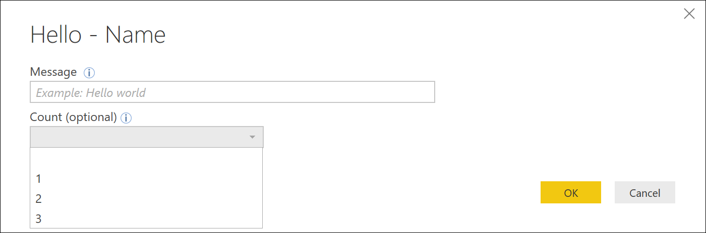
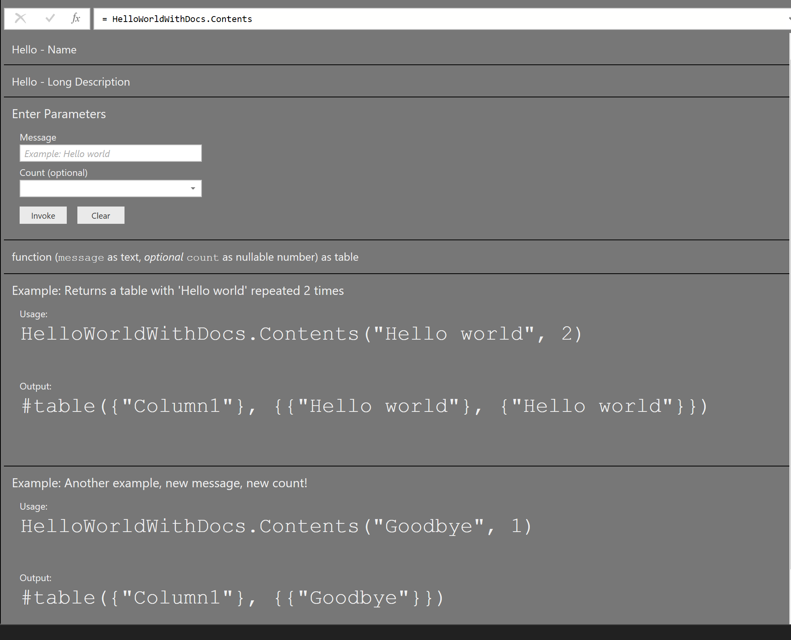

# Hello World with Documentation

This sample shows how to add documentation to your shared functions. To simply the code sample, the project is not using string or icon resources. In a real extension, you would use `Extension.LoadString` to load (localized) strings from your resources.resx file.

**Function invocation**

**Function info**

