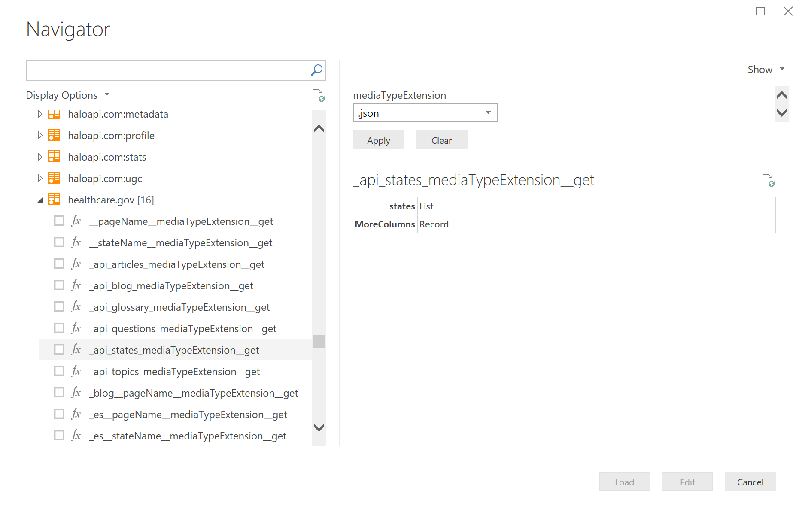

# OpenAPI (Swagger) Sample

Open API (aka Swagger) is a standard for describing REST APIs through a JSON definition. 
Swagger allows clients to interact with a given REST API without pre-existing knowledge of the source. 
Swagger is a very similar in concept to OData, but can be thought of a way to describe Function calls, as opposed to OData's focus on standardized data retrieval.

The `OpenApi.Document` function in the M engine can be used to create a simple Data Connector from a Swagger document.

> **Note:** `OpenApi.Document` is only available via extensibility. You will not be able to directly invoke this function from Power BI Desktop or other Power Query experiences.

## Limitations

* Support for Open API 2.0 (Swagger) - Open API 3.0 is not supported
* Only `GET` operations are supported - `POST` and `PUT` operations are ignored
* Only `json` content types are supported
* Security Definitions are only supported for Basic and Anonymous auth
** Other security types should be implemented within the connector (set `ManualCredentials` to true)
* Results will be formatted to conform to the schema defined in the swagger document
** Set `IncludeMoreColumns` to `true` if you want all columns to be included in the return value

Note - unlike OData, Swagger does not have built-in concepts of paging or query filters.
Extensions built using OpenApi.Document will need to implement this functionality in the connector code.

## Options

The following table lists the fields that can be passed in through the `options` parameter.

|Option                |Type    |Details                                             |
|:---------------------|:-------|:---------------------------------------------------|
|Headers			   |record  | HTTP headers to include in all generated functions.|
|IncludeDeprecated	   |logical | **Default: false**. When true, operations marked as deprecated will be included in the nav table. |
|IncludeExtensions	   |logical | **Default: false**. When true, vendor extensions ("x-*" properties) will be included as meta values on the navigation table and functions. |
|IncludeMoreColumns	   |logical | **Default: false**. When true, fields in the result set that are not explicitly defined in the result schema will be included in the `[MoreColumns]` column. When set to false, the result set will strictly conform to the schema defined in the swagger. |
|ManualCredentials	   |logical | **Default: false**. When true, ignore any security definitions defined in the swagger document. |
|ManualStatusHandling  |list    | List of HTTP status codes that will be handled by the extension. | 
|Query				   |record  | Query string parameters to include in all generated functions. |
|SecurityDefinition	   |text    | Name of the security definition to use from the swagger file. If not specified, the first definition will be used. |

## Samples 

This project contains multiple function samples. The sections below provide a short overview of each one.

### OpenApiSample.Petstore

Dynamically loads the [swagger petstore sample](http://petstore.swagger.io/v2/swagger.json) and returns the nav table without additional processing.
Will only work with the operations that support anonymous authentication.

### OpenApiSample.ApisGuru

1. Loads the [apis.guru](http://apis.guru/) swagger definition from an extension 
2. Calls the `listAPIs` function defined in the swagger
3. Converts the results of `listAPIs` to nested navigation tables

Note, given the [limitations] described above, the majority of the APIs found here will not work without additional processing from a custom connector.

### Additional Samples

Please see the [Data.World Swagger](../DataWorldSwagger) sample for a connector with custom OAuth flow, and API Key based authentication.
