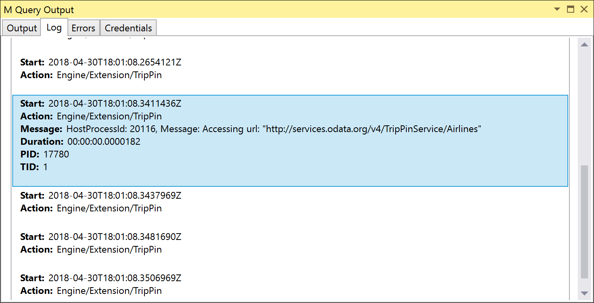
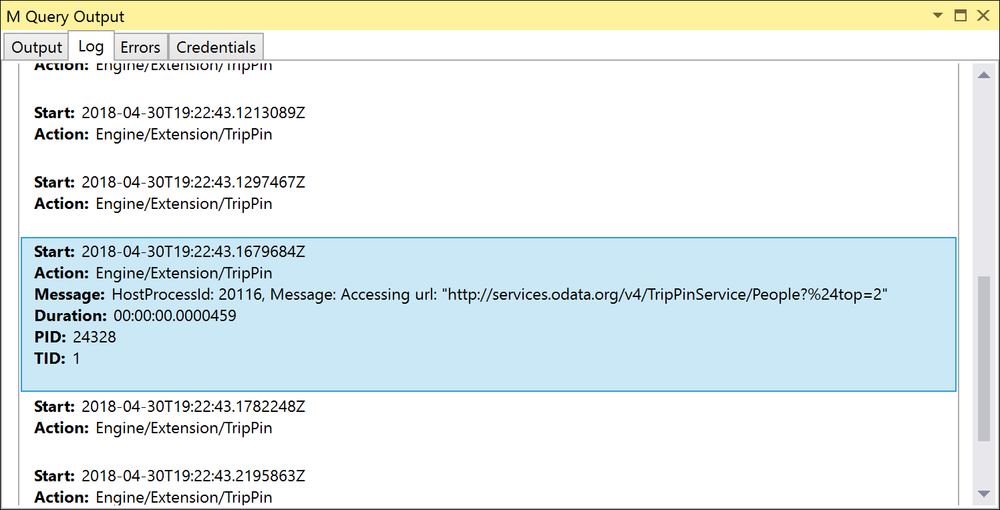

# TripPin Part 10 - Query Folding (part 1)

This multi-part tutorial covers the creation of a new data source extension for Power Query. The tutorial is meant to be done sequentially - each lesson builds on the connector created in previous lessons, incrementally adding new capabilities to your connector.

In this lesson, you will:

* Learn the basics of query folding 
* Learn about the `Table.View` function 
* Replicate OData query folding handlers for
  * `$top`
  * `$skip`
  * `$count`
  * `$select`
  * `$orderby`

One of the powerful features of the M language is its ability to push transformation work to underlying data source(s). This capability is referred to as _Query Folding_ (other tools/technologies also refer to similar function as Predicate Pushdown, or Query Delegation).
When creating a custom connector which uses an M function with built-in query folding capabilities, such as `OData.Feed` or `Odbc.DataSource`, your connector will automatically inherit this capability for free.
This tutorial will replicate the built-in query folding behavior for OData by implementing function handlers for the `Table.View` function.
This part of the tutorial will implement some of the _easier_ handlers to implement (i.e. the ones that don't require expression parsing and state tracking).
Future tutorials will implement more advanced query folding functionality.

To understand more about the query capabilities that an OData service might offer, please review the [OData v4 URL Conventions](http://docs.oasis-open.org/odata/odata/v4.0/errata03/os/complete/part2-url-conventions/odata-v4.0-errata03-os-part2-url-conventions-complete.html#_Toc453752357).

> **Note:** As stated above, the `OData.Feed` function will automatically provide query folding capabilities.
> Since the TripPin series is treating the OData service as a regular REST API, using `Web.Contents` rather than
> `OData.Feed`, we need to implement the query folding handlers ourselves. For real world usage, it is recommended
> that you use `OData.Feed` whenever possible.

Please see the [Table.View documentation](../../../docs/table-view.md) for more information about query folding in M.

## Using Table.View

The [Table.View](../../../docs/table-view.md) function allows a custom connector to override default transformation handlers
for your data source. An implementation of `Table.View` will provide a function for one or more of the supported handlers.
If a handler is unimplemented, or returns an `error` during evaluation, the M engine will fall back to its default handler.

When a custom connector uses a function that does not support implicit query folding, such as `Web.Contents`, default transformation
handlers will always be performed locally. If the REST API you are connecting to supports query parameters as part of the query,
`Table.View` will allow you to add optimizations that allow transformation work to be pushed to the service.

The `Table.View` function has the following signature:

```
Table.View(table as nullable table, handlers as record) as table
```

Your implementation will wrap your main data source function. There are two required handlers for `Table.View`:

1. `GetType`: returns the expected `table type` of the query result
2. `GetRows`: returns the actual `table` result of your data source function

The simplest implementation would be similar to the following:

```
TripPin.SuperSimpleView = (url as text, entity as text) as table =>
    Table.View(null, [
        GetType = () => Value.Type(GetRows()),
        GetRows = () => GetEntity(url, entity)
    ]);
```

Update the `TripPinNavTable` function to call `TripPin.SuperSimpleView` rather than `GetEntity`:

```
withData = Table.AddColumn(rename, "Data", each TripPin.SuperSimpleView(url, [Name]), type table),
```

If you re-run the unit tests, you'll see that the behavior of your function hasn't changed. In this case
your Table.View implementation is simply passing through the call to `GetEntity`. Since your haven't implemented
any transformation handlers (yet!), the original `url` parameter remains untouched.

## Initial Implementation of Table.View

The above implementation of `Table.View` is simple, but not very useful. The following implementation will be used as
our baseline - it doesn't implement any folding functionality, but has the scaffolding we will need to do it.

```
TripPin.View = (baseUrl as text, entity as text) as table =>
    let
        // Implementation of Table.View handlers.
        //
        // We wrap the record with Diagnostics.WrapHandlers() to get some automatic
        // tracing if a handler returns an error.
        //
        View = (state as record) => Table.View(null, Diagnostics.WrapHandlers([
            // Returns the table type returned by GetRows()
            GetType = () => CalculateSchema(state),

            // Called last - retrieves the data from the calculated URL
            GetRows = () => 
                let
                    finalSchema = CalculateSchema(state),
                    finalUrl = CalculateUrl(state),

                    result = TripPin.Feed(finalUrl, finalSchema),
                    appliedType = Table.ChangeType(result, finalSchema)
                in
                    appliedType,

            //
            // Helper functions
            //
            // Retrieves the cached schema. If this is the first call
            // to CalculateSchema, the table type is calculated based on
            // the entity name that was passed into the function.
            CalculateSchema = (state) as type =>
                if (state[Schema]? = null) then
                    GetSchemaForEntity(entity)
                else
                    state[Schema],

            // Calculates the final URL based on the current state.
            CalculateUrl = (state) as text => 
                let
                    urlWithEntity = Uri.Combine(state[Url], state[Entity])
                in
                    urlWithEntity
        ]))
    in
        View([Url = baseUrl, Entity = entity]);
```

If you look at the call to `Table.View`, you'll see an additional wrapper function around the `handlers` record - `Diagnostics.WrapHandlers`. 
This helper function is found in the Diagnostics module (that was introduced in a previous tutorial), and provides us with a useful way
to automatically trace any errors raised by individual handlers.

The `GetType` and `GetRows` functions have been updated to make use of two new helper functions - `CalculateSchema` and `CaculateUrl`. 
Right now the implementations of those functions are fairly straightforward - you'll notice they contain parts of what was previously
done by the `GetEntity` function. 

Finally, you'll notice that we're defining an internal function (`View`) that accepts a `state` parameter.
As we implement more handlers, they will recursively call the internal `View` function, updating and
passing along `state` as they go.

Update the `TripPinNavTable` function once again, replacing the call to `TripPin.SuperSimpleView` with 
a call to the new `TripPin.View` function, and re-run the unit tests. You won't see any new functionality yet,
but we now have a solid baseline for testing.

## Implementing Query Folding

Since the M engine will automatically fall back to local processing when a query can't be folded, you must take some additional
steps to validate that your `Table.View` handlers are working correctly. 

The manual way to validate folding behavior is to watch the URL requests your unit tests make using a tool like Fiddler. Alternatively,
the diagnostic logging we added to `TripPin.Feed` will emit the full URL being run, which *should* include the OData query string parameters
our handlers will add. 

An automated way to validate query folding is to force your unit test execution to fail if a query doesn't fully fold. You can do this
by opening the project properties, and setting **Error on Folding Failure** to **True**. With this setting enabled,
any query that requires local processing results in the following error:

**We couldn't fold the expression to the source. Please try a simpler expression.**

You can test this out by adding a new `Fact` to your unit test file that contains one or more table transformations.

```
// Query folding tests
Fact("Fold $top 1 on Airlines", 
    #table( type table [AirlineCode = text, Name = text] , {{"AA", "American Airlines"}} ), 
    Table.FirstN(Airlines, 1)
)
```

> The _Error on Folding Failure_ setting is an "all or nothing" approach. If you want to test queries that aren't designed to fold
> as part of your unit tests, you'll need to add some conditional logic to enable/disable tests accordingly.

The remaining sections of this tutorial will each add a new Table.View handler. We will be taking a [Test Driven Development (TDD)](https://en.wikipedia.org/wiki/Test-driven_development)
approach, where we first add failing unit tests, and then implement the M code to resolve them.

Each handler section below will describe the functionality provided by the handler, the OData equivalent query syntax, the unit tests, and the implementation.
Using the scaffolding code described above, each handler implementation requires two changes:

1. Adding the handler to Table.View that will update the `state` record
2. Modifying `CalculateUrl` to retrieve the values from the `state` and add to the url and/or query string parameters

### Handling Table.FirstN with OnTake

The [OnTake handler](../../../docs/table-view.md#ontake) receives a `count` parameter, which is the maximum number of rows to take.
In OData terms, we can translate this to the [$top](http://docs.oasis-open.org/odata/odata/v4.0/errata03/os/complete/part2-url-conventions/odata-v4.0-errata03-os-part2-url-conventions-complete.html#_Toc453752362) query parameter. 

We'll use the following unit tests:

```
// Query folding tests
Fact("Fold $top 1 on Airlines", 
    #table( type table [AirlineCode = text, Name = text] , {{"AA", "American Airlines"}} ), 
    Table.FirstN(Airlines, 1)
),
Fact("Fold $top 0 on Airports", 
    #table( type table [Name = text, IataCode = text, Location = record] , {} ), 
    Table.FirstN(Airports, 0)
),
```

These tests both use `Table.FirstN` to filter to the result set to the first X number of rows.
If you run these tests with _Error on Folding Failure_ set to `False` (the default), the tests should succeed, but if you run Fiddler (or check the trace logs),
you'll see that the request we send doesn't contain any OData query parameters. 



If you set _Error on Folding Failure_ to `True`, they will fail with the "Please try a simpler expression." error. To fix this, we'll define our first Table.View handler for `OnTake`.

The OnTake handler looks like this:

```
OnTake = (count as number) =>
    let
        // Add a record with Top defined to our state
        newState = state & [ Top = count ]
    in
        @View(newState),
```

The `CalculateUrl` function is updated to extract the `Top` value from the `state` record, and set the right
parameter in the query string.

```
// Calculates the final URL based on the current state.
CalculateUrl = (state) as text => 
    let
        urlWithEntity = Uri.Combine(state[Url], state[Entity]),

        // Uri.BuildQueryString requires that all field values
        // are text literals.
        defaultQueryString = [],

        // Check for Top defined in our state
        qsWithTop =
            if (state[Top]? <> null) then
                // add a $top field to the query string record
                defaultQueryString & [ #"$top" = Number.ToText(state[Top]) ]
            else
                defaultQueryString,

        encodedQueryString = Uri.BuildQueryString(qsWithTop),
        finalUrl = urlWithEntity & "?" & encodedQueryString
    in
        finalUrl
```

Rerunning the unit tests, we can see that the URL we are accessing now contains the `$top` parameter. (Note that due to URL encoding, $top appears as `%24top`, but the OData service is smart enough to convert it automatically).



### Handling Table.Skip with OnSkip

The [OnSkip handler](../../../docs/table-view.md#onskip) is a lot like OnTake. It receives a `count` parameter, which is the number of rows to skip from the result set.
This translates nicely to the OData [$skip](http://docs.oasis-open.org/odata/odata/v4.0/errata03/os/complete/part2-url-conventions/odata-v4.0-errata03-os-part2-url-conventions-complete.html#_Toc453752362) query parameter. 

Unit tests:

```
// OnSkip
Fact("Fold $skip 14 on Airlines",
    #table( type table [AirlineCode = text, Name = text] , {{"EK", "Emirates"}} ), 
    Table.Skip(Airlines, 14)
),
Fact("Fold $skip 0 and $top 1",
    #table( type table [AirlineCode = text, Name = text] , {{"AA", "American Airlines"}} ),
    Table.FirstN(Table.Skip(Airlines, 0), 1)
),
```

Implementation:

```
// OnSkip - handles the Table.Skip transform.
// The count value should be >= 0.
OnSkip = (count as number) =>
    let
        newState = state & [ Skip = count ]
    in
        @View(newState),
```

Matching updates to `CalculateUrl`:

```
qsWithSkip = 
    if (state[Skip]? <> null) then
        qsWithTop & [ #"$skip" = Number.ToText(state[Skip]) ]
    else
        qsWithTop,
```

### Handling Table.SelectColumns with OnSelectColumns

The [OnSelectColumns](../../../docs/table-view.md#onselectcolumns) handler is called when the user selects or removes columns from the result set. The handler receives a `list` of `text` values, representing the column(s) to be selected.
In OData terms, this operation will map to the [$select](http://docs.oasis-open.org/odata/odata/v4.0/errata03/os/complete/part2-url-conventions/odata-v4.0-errata03-os-part2-url-conventions-complete.html#_Toc453752360) query option.
The advantage of folding column selection becomes apparent when you are dealing with tables with many columns. The $select operator will remove unselected columns from the result set, resulting in
more efficient queries.

Unit tests:

```
// OnSelectColumns
Fact("Fold $select single column", 
    #table( type table [AirlineCode = text] , {{"AA"}} ),
    Table.FirstN(Table.SelectColumns(Airlines, {"AirlineCode"}), 1)
),
Fact("Fold $select multiple column", 
    #table( type table [UserName = text, FirstName = text, LastName = text],{{"russellwhyte", "Russell", "Whyte"}}), 
    Table.FirstN(Table.SelectColumns(People, {"UserName", "FirstName", "LastName"}), 1)
),
Fact("Fold $select with ignore column", 
    #table( type table [AirlineCode = text] , {{"AA"}} ),
    Table.FirstN(Table.SelectColumns(Airlines, {"AirlineCode", "DoesNotExist"}, MissingField.Ignore), 1)
),
```

The first two tests select different numbers of columns with `Table.SelectColumns`, and include a `Table.FirstN` call to simplify the test case. 

> **Note:** if the test were to simply return the column names (using `Table.ColumnNames`), and not any data, the request to the OData service will never actually be sent.
> this is because the call to `GetType` will return the schema, which contains all of the info the M engine needs to calculate the result. 

The third test uses the `MissingField.Ignore` option, which tells the M engine to ignore any selected columns that don't exist in the result set.
The `OnSelectColumns` handler does not need to worry about this option - the M engine will handle it automatically (i.e. missing columns won't be included in the `columns` list).

> **Note:** the other option for `Table.SelectColumns`, `MissingField.UseNull`, requires a connector to implement the `OnAddColumn` handler.
> This will be done in a subsequent lesson.

The implementation for `OnSelectColumns` does two things:

1. Adds the list of selected columns to the `state`
2. Re-calculates the `Schema` value so we can set the right table type

```
OnSelectColumns = (columns as list) =>
    let
        // get the current schema
        currentSchema = CalculateSchema(state),
        // get the columns from the current schema (which is an M Type value)
        rowRecordType = Type.RecordFields(Type.TableRow(currentSchema)),
        existingColumns = Record.FieldNames(rowRecordType),
        // calculate the new schema
        columnsToRemove = List.Difference(existingColumns, columns),
        updatedColumns = Record.RemoveFields(rowRecordType, columnsToRemove),
        newSchema = type table (Type.ForRecord(updatedColumns, false))
    in
        @View(state & 
            [ 
                SelectColumns = columns,
                Schema = newSchema
            ]
        ),
```

`CalculateUrl` is updated to retrieve the list of columns from the state, and combine them (with a separator) for the $select parameter.

```
// Check for explicitly selected columns
qsWithSelect =
    if (state[SelectColumns]? <> null) then
        qsWithSkip & [ #"$select" = Text.Combine(state[SelectColumns], ",") ]
    else
        qsWithSkip,
```

### Handling Table.Sort with OnSort

The [OnSort](../../../docs/table-view.md#onsort) handler receives a `list` of `record` values. Each record contains a `Name` field, indicating the name of the column, and an `Order` field which is equal to `Order.Ascending` or `Order.Descending`. 
In OData terms, this operation will map to the [$orderby](http://docs.oasis-open.org/odata/odata/v4.0/errata03/os/complete/part2-url-conventions/odata-v4.0-errata03-os-part2-url-conventions-complete.html#_Toc453752361) query option.
The $orderby syntax has the column name followed by `asc` or `desc` to indicate Ascending or Descending order. When sorting on multiple columns, the values are separated with a comma. Note, if the `columns` parameter contains more than one item, it is important to maintain the order in which they appear.

Unit tests:

```
// OnSort
Fact("Fold $orderby single column",
    #table( type table [AirlineCode = text, Name = text], {{"TK", "Turkish Airlines"}}),
    Table.FirstN(Table.Sort(Airlines, {{"AirlineCode", Order.Descending}}), 1)
),
Fact("Fold $orderby multiple column",
    #table( type table [UserName = text], {{"javieralfred"}}),
    Table.SelectColumns(Table.FirstN(Table.Sort(People, {{"LastName", Order.Ascending}, {"UserName", Order.Descending}}), 1), {"UserName"})
)
```

Implementation:

```
// OnSort - receives a list of records containing two fields: 
//    [Name]  - the name of the column to sort on
//    [Order] - equal to Order.Ascending or Order.Descending
// If there are multiple records, the sort order must be maintained.
//
// OData allows you to sort on columns that do not appear in the result
// set, so we do not have to validate that the sorted columns are in our 
// existing schema.
OnSort = (order as list) =>
    let
        // This will convert the list of records to a list of text,
        // where each entry is "<columnName> <asc|desc>"
        sorting = List.Transform(order, (o) => 
            let
                column = o[Name],
                order = o[Order],
                orderText = if (order = Order.Ascending) then "asc" else "desc"
            in
                column & " " & orderText
        ),
        orderBy = Text.Combine(sorting, ", ")
    in
        @View(state & [ OrderBy = orderBy ]),
```

Updates to `CalculateUrl`:

```
qsWithOrderBy = 
    if (state[OrderBy]? <> null) then
        qsWithSelect & [ #"$orderby" = state[OrderBy] ]
    else
        qsWithSelect,
```

### Handling Table.RowCount with GetRowCount

Unlike the other query handlers we've implemented, the [GetRowCount](../../../docs/table-view.md#getrowcount) handler will return a single value - the number of rows expected in the result set. In an M query, this would typically be the result of the `Table.RowCount` transform.
We have a few different options on how to handle this as part of an OData query. 

* The [$count query parameter](http://docs.oasis-open.org/odata/odata/v4.0/errata03/os/complete/part1-protocol/odata-v4.0-errata03-os-part1-protocol-complete.html#_The_$inlinecount_System), which returns the count as a separate field in the result set.
* The [/$count path segment](http://docs.oasis-open.org/odata/odata/v4.0/errata03/os/complete/part1-protocol/odata-v4.0-errata03-os-part1-protocol-complete.html#_Toc453752292), which will return **only** the total count, as a scalar value.

The downside to the query parameter approach is that still need to send the entire query to the OData service. Since the count comes back inline as part of the result set, we'll have to process the first page of data from the result set.
While this is still more efficient then reading the entire result set and counting the rows, it's probably still more work than we want to do.

The advantage of the path segment approach is that we'll only receive a single scalar value in the result. This makes the entire operation a lot more efficient.
However, as described in the OData spec, the /$count path segment will return an error if you include other query parameters, such as $top or $skip, which limits its usefulness.

In this tutorial, we'll implement the GetRowCount handler using the path segment approach. To avoid the errors you'd get if other query parameters are included, we will check for other state values, and return an "unimplemented error" (`...`) if we find any.
Returning any error from a `Table.View` handler tells the M engine that the operation cannot be folded, and it should fallback to the default handler instead (which in this case would be counting the total number of rows).

First, we'll add a simple unit test:

```
// GetRowCount
Fact("Fold $count", 15, Table.RowCount(Airlines)),
```

Since the /$count path segment returns a single value (in plain/text format), rather than a json result set, we'll also have to add a new internal function (`TripPin.Scalar`) for making the request and handling the result.

```
// Similar to TripPin.Feed, but is expecting back a scalar value.
// This function returns the value from the service as plain text.
TripPin.Scalar = (url as text) as text =>
    let
        _url = Diagnostics.LogValue("TripPin.Scalar url", url),

        headers = DefaultRequestHeaders & [
            #"Accept" = "text/plain"
        ],

        response = Web.Contents(_url, [ Headers = headers ]),
        toText = Text.FromBinary(response)
    in
        toText;
```

The implementation will then use this function (if no other query parameters are found in the `state`):

```
GetRowCount = () as number =>
    if (Record.FieldCount(Record.RemoveFields(state, {"Url", "Entity", "Schema"}, MissingField.Ignore)) > 0) then
        ...
    else
        let
            newState = state & [ RowCountOnly = true ],
            finalUrl = CalculateUrl(newState),
            value = TripPin.Scalar(finalUrl),
            converted = Number.FromText(value)
        in
            converted,
```

The `CalculateUrl` function is updated to append "/$count" to the URL if the `RowCountOnly` field is set in the `state`.

```
// Check for $count. If all we want is a row count,
// then we add /$count to the path value (following the entity name).
urlWithRowCount =
    if (state[RowCountOnly]? = true) then
        urlWithEntity & "/$count"
    else
        urlWithEntity,
```

The new `Table.RowCount` unit test should now pass.

To test the fallback case, we'll add another test that forces the error.
First, we'll add a helper method which checks result of a `try` operation for a folding error. 

```
// Returns true if there is a folding error, or the original record (for logging purposes) if not.
Test.IsFoldingError = (tryResult as record) =>
    if ( tryResult[HasError]? = true and tryResult[Error][Message] = "We couldn't fold the expression to the data source. Please try a simpler expression.") then
        true
    else
        tryResult;
```

Then we add a test that uses both `Table.RowCount` and `Table.FirstN` to force the error.

```
// test will fail if "Fail on Folding Error" is set to false
Fact("Fold $count + $top *error*", true, Test.IsFoldingError(try Table.RowCount(Table.FirstN(Airlines, 3)))),
```

An important note here is that this test will now return an error if _Error on Folding Error_ is set to `false`, because the `Table.RowCount` operation will fall back to the local (default) handler.
Running the tests with _Error on Folding Error_ set to `true` will cause `Table.RowCount` to fail, and allows the test to succeed.

## Conclusion

Implementing `Table.View` for your connector adds a significant amount of complexity to your code.
Since the M engine can process all transformations locally, adding `Table.View` handlers does not enable new scenarios for your users, but will result in more efficient processing (and potentially, happier users).
One of the main advantages of the `Table.View` handlers being optional is that it allows you to incrementally add new functionality without impacting backwards compatibility for your connector.

For most connectors, an important (and basic) handler to implement is `OnTake` (which translates to `$top` in OData), as it limits the amount of rows returned. The Power Query experience will always perform an
`OnTake` of `1000` rows when displaying previews in the navigator and query editor, so your users might see significant performance improvements when working with larger data sets.

In subsequent tutorials, we will look at the more advanced query handlers (such as `OnSelectRows`), which require translating M expressions.
