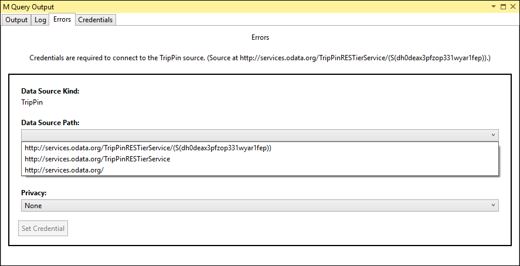
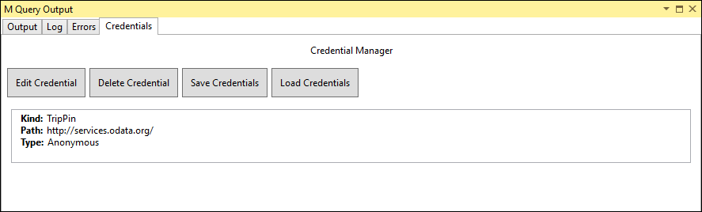
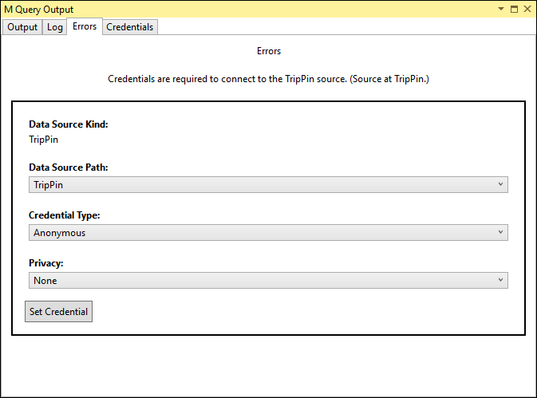
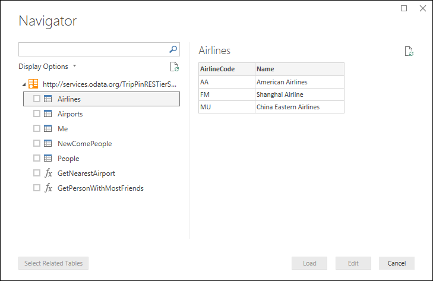
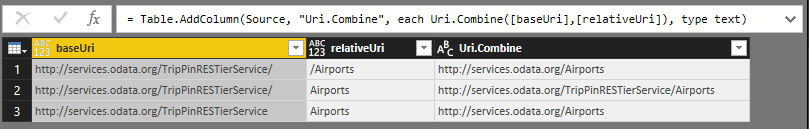
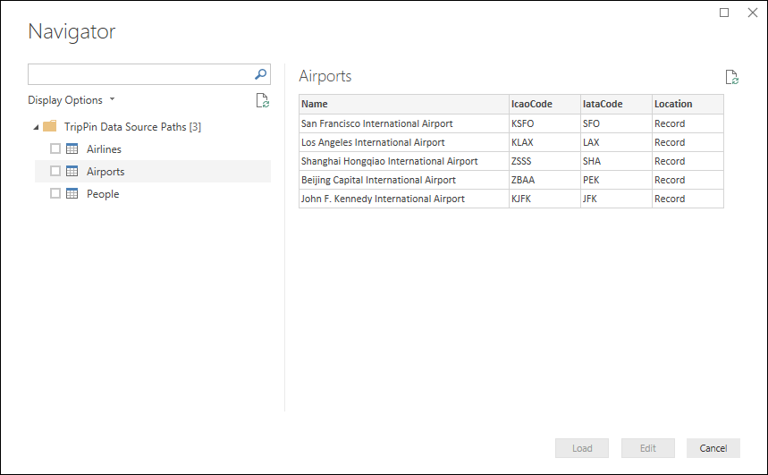

# TripPin Part 4 - Data Source Paths
This multi-part tutorial covers the creation of a new data source extension for Power Query. The tutorial is meant to be done sequentially – each lesson builds on the connector created in previous lessons, incrementally adding new capabilities to your connector. 

In this lesson, you will:

* Simplify the connection logic for our connector
* Improve the navigation table experience
 
This lesson simplifies the connector built in the [previous lesson](../3-NavTables) by removing its required function parameters, and improving the user experience by moving to a dynamically generated navigation table.

For an in-depth explanation of how credentials are identified, please see the [Data Source Paths section](../../../docs/m-extensions.md#data-source-paths) of the [M extensibility reference](../../../docs/m-extensions.md).

## Data Source Paths
When invoking a [data source function](../../../docs/m-extensions.md#data-source-functions), the M engine identifies which credentials to use during an evaluation by doing a lookup based on the [Data Source Kind](../../../docs/m-extensions.md#data-source-kind) and [Data Source Path](../../../docs/m-extensions.md#data-source-paths) values.

In the [previous lesson](../3-NavTables) we shared two data source functions, both with a single `Uri.Type` parameter. 

```
[DataSource.Kind="TripPin"]
shared TripPin.Feed = Value.ReplaceType(TripPinImpl, type function (url as Uri.Type) as any);

[DataSource.Kind="TripPin", Publish="TripPin.Publish"]
shared TripPin.Contents =  Value.ReplaceType(TripPinNavTable, type function (url as Uri.Type) as any);
```

The first time we run a query that one of the functions, we receive a credential prompt with drop downs that let us select a path and an authentication type. 



If we run the same query again, with the same parameters, the M engine is able to locate the cached credentials, and no credential prompt is shown. If we modify the `url` argument to our function so that the base path no longer matches, a new credential prompt is displayed for the new path.

You can see any cached credentials on the Credentials table in the M Query Output window.



Depending on the type of change, modifying the parameters for your function will likely result in a credential error. 

## Simplifying the Connector
We will simplify our connector by removing the parameters for our data source function (`TripPin.Contents`). We will also remove the `shared` qualifier for `TripPin.Feed`, and leave it as an internal-only function. 

One of the design philosophies of Power Query is to keep the initial data source dialog as simple as possible. If at all possible, we provide the user with choices at the Navigator level, rather on the connection dialog.
If a user provided value can be determined programmatically, consider adding it as the top level of your navigation table rather than a function parameter.

For example, when connecting to a relational database, you might need server, database, and table names.
Once you know the server to connect to, and credentials have been provided, you could use the database's API to fetch a list of databases, and a list of tables contained within each database.
In this case, to keep your initial connect dialog as simple as possible, only the server name should be a required parameter - Database and Table would be levels of your navigation table.

Since the TripPin service has a fixed URL endpoint, we don't need to prompt the user for any values. We will remove the url parameter from our function, and define a BaseUrl variable in our connector. 

```
BaseUrl = "http://services.odata.org/TripPinRESTierService/(S(ejvc5qehmzmktnv1xnzzwpv2))/";

[DataSource.Kind="TripPin", Publish="TripPin.Publish"]
shared TripPin.Contents = () => TripPinNavTable(BaseUrl) as table;
```

We will keep the `TripPin.Feed` function, but no longer make it shared, no longer associate it with a Data Source Kind, and simplify its declaration. From this point on, we will only use it internally within this section document.

```
TripPin.Feed = (url as text) =>
    let
        source = Web.Contents(url, [ Headers = DefaultRequestHeaders ]),
        json = Json.Document(source)
    in
        json;
```

If we update the `TripPin.Contents()` call in our `TripPin.query.pq` file and run it in Visual Studio, we will see a new credential prompt. Note that there is now a single Data Source Path value - TripPin.



## Improving the Navigation Table
In the [first tutorial](../1-OData) we used the built-in OData functions to connect to the TripPin service.
This gave us a really nice looking navigation table, based on the TripPin service document, with no additional code on our side.
The [OData.Feed](https://msdn.microsoft.com/library/mt260868.aspx) function automatically did the hard work for us.
Since we are "roughing it" by using [Web.Contents](https://msdn.microsoft.com/library/mt260892.aspx) rather than [OData.Feed](https://msdn.microsoft.com/library/mt260868.aspx), we will need to recreate this navigation table ourselves. 



We're going to make the following changes:
1. Define a list of items to show in our navigation table
2. Do away with the entity specific functions (`GetAirlineTables` and `GetAirportsTable`)

### Generating a Navigation Table from a List
We will list the entities we want to expose in the navigation table, and build the appropriate URL to access them. 
Since all of the entities are under the same root path, we'll be able build these URLs dynamically.

> To simplify the example, we'll only expose the three entity sets (Airlines, Airports, People), which would be exposed as Tables in M, and skip the singleton (Me) which would be exposed as a Record. We will skip adding the functions until a later lesson.

```
RootEntities = {
    "Airlines",
    "Airports",
    "People"
};
```

We then update our `TripPinNavTable` function to build the table a column at a time.
The [Data] column for each entity is retrieved by calling `TripPin.Feed` with the full URL to the entity. 

```
TripPinNavTable = (url as text) as table =>
    let
        entitiesAsTable = Table.FromList(RootEntities, Splitter.SplitByNothing()),
        rename = Table.RenameColumns(entitiesAsTable, {{"Column1", "Name"}}),
        // Add Data as a calculated column
        withData = Table.AddColumn(rename, "Data", each TripPin.Feed(Uri.Combine(url, [Name])), Uri.Type),
        // Add ItemKind and ItemName as fixed text values
        withItemKind = Table.AddColumn(withData, "ItemKind", each "Table", type text),
        withItemName = Table.AddColumn(withItemKind, "ItemName", each "Table", type text),
        // Indicate that the node should not be expandable
        withIsLeaf = Table.AddColumn(withItemName, "IsLeaf", each true, type logical),
        // Generate the nav table
        navTable = Table.ToNavigationTable(withIsLeaf, {"Name"}, "Name", "Data", "ItemKind", "ItemName", "IsLeaf")
    in
        navTable;
```

When dynamically building URL paths, make sure you're clear where your forward slashes (/) are!
Note that [Uri.Combine](https://msdn.microsoft.com/library/mt260885) uses the following rules when combining paths:
1. When the `relativeUri` parameter starts with a /, it will replace the entire path of the `baseUri` parameter
2. If the `relativeUri` parameter _does not_ start with a / and the `baseUri` ends with a /, the path is appended
3. If the `relativeUri` parameter _does not_ start with a / and the `baseUri` _does not_ end with a /, the last segment of the path is replaced

The following image shows examples of this:



### Remove the Entity Specific Functions
To make our connector easier to maintain, we will remove the entity specific formatting functions we used in the previous lesson - `GetAirlineTables` and `GetAirportsTable`.
Instead, we will update `TripPin.Feed` to process the JSON response in a way that will work for all of our entities.
Specifically, we take the `value` field of the returned OData JSON payload, and convert it from a list of records to a table. 

```
TripPin.Feed = (url as text) =>
    let
        source = Web.Contents(url, [ Headers = DefaultRequestHeaders ]),
        json = Json.Document(source),
        // The response is a JSON record - the data we want is a list of records in the "value" field
        value = json[value],
        asTable = Table.FromList(value, Splitter.SplitByNothing()),
        // expand all columns from the record
        fields = Record.FieldNames(Table.FirstValue(asTable, [Empty = null])),
        expandAll = Table.ExpandRecordColumn(asTable, "Column1", fields)
    in
        expandAll;
```

> **Note:** A disadvantage of using a generic approach to process your entities is that we lose the nice formating and type information for our entities. We will show how to enforce schema on REST API calls in a later lesson. 

## Conclusion
In this tutorial, we cleaned up and simplified our connector by fixing our Data Source Path value, and moving to a more flexible format for our navigation table. After completing these steps (or using the sample code in this directory), the `TripPin.Contents` function returns a navigation table in Power BI Desktop:


