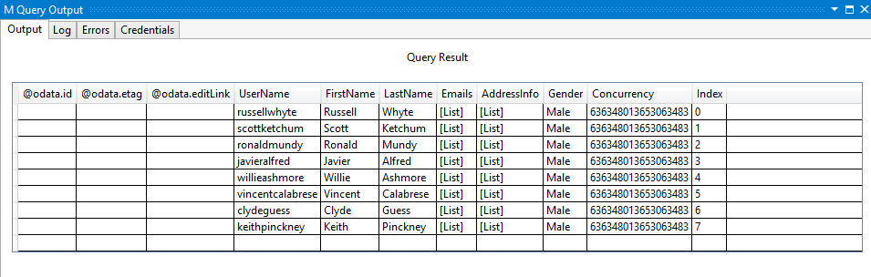
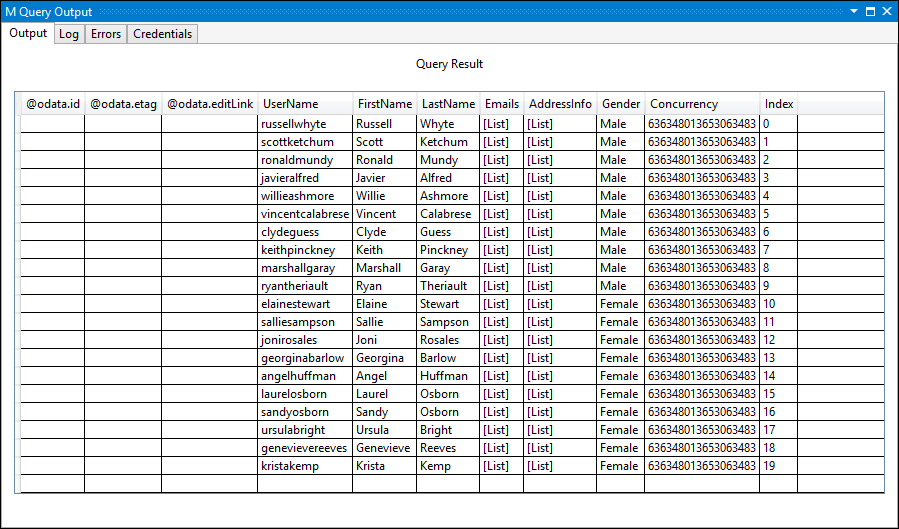
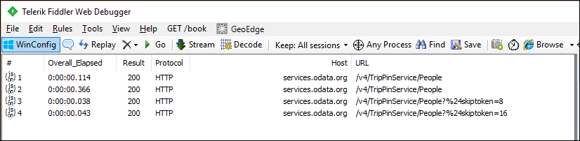

# TripPin Part 5 - Paging
This multi-part tutorial covers the creation of a new data source extension for Power Query. The tutorial is meant to be done sequentially – each lesson builds on the connector created in previous lessons, incrementally adding new capabilities to your connector. 

In this lesson, you will:

* Add paging support to the connector
 
Many Rest APIs will return data in "pages", requiring clients to make multiple requests to stitch the results together. 
Although there are some common conventions for pagination (such as [RFC 5988](https://tools.ietf.org/html/rfc5988)), it 
generally varies from API to API. Thankfully, TripPin is an OData service, and the [OData standard](http://docs.oasis-open.org/odata/odata-json-format/v4.0/cs01/odata-json-format-v4.0-cs01.html)
defines a way of doing pagination using [odata.nextLink](http://docs.oasis-open.org/odata/odata-json-format/v4.0/cs01/odata-json-format-v4.0-cs01.html#_Toc365464689) 
values returned in the body of the response.

To simplify [previous iterations](../TripPin/) of the connector, the `TripPin.Feed` function was not 'page aware'. 
It simply parsed whatever JSON was returned from the request, and formatted it as a table. Those familiar with the 
OData protocol might have noticed that we made a number of incorrect assumptions on the [format of the response](http://docs.oasis-open.org/odata/odata-json-format/v4.0/cs01/odata-json-format-v4.0-cs01.html#_Toc365464681)
(such as assuming there is a `value` field containing an array of records). 
In this lesson we will improve our response handling logic by making it page aware.
Future tutorials will make the page handling logic more robust and able to handle multiple response formats (including errors from the service).

>**Note:** You do not need to implement your own paging logic with connectors based on [OData.Feed](https://msdn.microsoft.com/library/mt260868.aspx), as it handles it all for you automatically.

## Paging Checklist
When implementing paging support, we'll need to the following things about our API:

1. How do we request the next page of data?
2. Does the paging mechanism involve calculating values, or do we extract the URL for the next page from the response?
3. How do we know when to stop paging? 
4. Are there parameters related to paging that we should be aware of? (such as "page size")

The answer to these questions will impact the way you implement your paging logic. While there is some amount of code reuse
across paging implementations (such as the use of [Table.GenerateByPage]), most connectors will
end up requiring custom logic.

>**Note:** This lesson contains paging logic for an OData service, which follows a specific format.
>Please check the documentation for your API to determine the changes you'll need to make in your connector to support its paging format.

## Overview of OData Paging 
OData paging is driven by [nextLink annotations](http://docs.oasis-open.org/odata/odata-json-format/v4.0/cs01/odata-json-format-v4.0-cs01.html#_Annotation_odata.nextLink) 
contained within the response payload. The nextLink value contains the URL to the next page of data. We know there is
another page of data by looking for an `odata.nextLink` field in outermost object in the response. If there is no `odata.nextLink` field, 
we've read all of our data. 

```json
{
  "odata.context": "...",
  "odata.count": 37,
  "value": [
    { },
    { },
    { }
  ],
  "odata.nextLink": "...?$skiptoken=342r89"
}
```

Some OData services allow clients to supply a [max page size preference](http://docs.oasis-open.org/odata/odata/v4.0/errata03/os/complete/part1-protocol/odata-v4.0-errata03-os-part1-protocol-complete.html#_The_odata.maxpagesize_Preference),
but it is up to the service on whether or not to honor it. Power Query should be able to handle responses of any size, so we won't 
worry about specifying a page size preference - we can support whatever the service throws at us.

> More information about [Server-Driven Paging](http://docs.oasis-open.org/odata/odata/v4.0/errata03/os/complete/part1-protocol/odata-v4.0-errata03-os-part1-protocol-complete.html#_Server-Driven_Paging) can be found in the OData specification

### Testing TripPin
Before we fix our paging implementation, let's confirm the current behavior of the extension from the [previous tutorial](../4-Paths). The following test query will retrieve the People table and add an index column to show our current row count.

```
let
    source = TripPin.Contents(),
    data = source{[Name="People"]}[Data],
    withRowCount = Table.AddIndexColumn(data, "Index")
in
    withRowCount
```

Turn on fiddler, and run the query in Visual Studio.
You'll notice that the query returns a table with 8 rows (index 0 to 7). 



If we look at the body of the response from fiddler, we see that it does in fact contain an `@odata.nextLink` field,
indicating that there are more pages of data available. 

```json
{
  "@odata.context": "http://services.odata.org/V4/TripPinService/$metadata#People",
  "@odata.nextLink": "http://services.odata.org/v4/TripPinService/People?%24skiptoken=8",
  "value": [
    { },
    { },
    { }
  ]
}
```

## Implementing Paging for TripPin
We're going to make the following changes to our extension:

1. Import the common `Table.GenerateByPage` function
2. Add a `GetAllPagesByNextLink` function which uses `Table.GenerateByPage` to glue all pages together
3. Add a `GetPage` function that can read a single page of data
4. Add a `GetNextLink` function to extract the next URL from the response
5. Update `TripPin.Feed` to use the new page reader functions

>**Note:** As stated earlier in this tutorial, paging logic will vary between data sources.
>The implementation here tries to break up the logic into functions that should be reusable
>for sources that use 'next links' returned in the response.

### Table.GenerateByPage
The `Table.GenerateByPage` function can be used to efficiently combine multiple 'pages' of data 
into a single table. It does this by repeatedly calling the function passed in as the `getNextPage` 
parameter, until it receives a `null`. The function parameter must take a single argument, and return a `nullable table`.

`getNextPage = (lastPage) as nullable table => ...`

Each call to `getNextPage` receives the output from the previous call. 

```
// The getNextPage function takes a single argument and is expected to return a nullable table
Table.GenerateByPage = (getNextPage as function) as table =>
    let        
        listOfPages = List.Generate(
            () => getNextPage(null),            // get the first page of data
            (lastPage) => lastPage <> null,     // stop when the function returns null
            (lastPage) => getNextPage(lastPage) // pass the previous page to the next function call
        ),
        // concatenate the pages together
        tableOfPages = Table.FromList(listOfPages, Splitter.SplitByNothing(), {"Column1"}),
        firstRow = tableOfPages{0}?
    in
        // if we didn't get back any pages of data, return an empty table
        // otherwise set the table type based on the columns of the first page
        if (firstRow = null) then
            Table.FromRows({})
        else        
            Value.ReplaceType(
                Table.ExpandTableColumn(tableOfPages, "Column1", Table.ColumnNames(firstRow[Column1])),
                Value.Type(firstRow[Column1])
            );
```

Some notes about `Table.GenerateByPage`:

- The `getNextPage` function will need to retrieve the next page URL
(or page number, or whatever other values are used to implement the paging logic).
This is generally done by adding `meta` values to the page before returning it.
- The columns and table type of the combined table (i.e. all pages together) are derived from
the first page of data. The `getNextPage` function should normalize each page of data. 
- The first call to `getNextPage` receives a null parameter.
- `getNextPage` must return null when there are no pages left

### Implementing GetAllPagesByNextLink
The body of our `GetAllPagesByNextLink` function implements the `getNextPage` function argument for 
`Table.GenerateByPage`. It will call the `GetPage` function, and retrieve the URL for the next page 
of data from the `NextLink` field of the `meta` record from the previous call.

```
// Read all pages of data.
// After every page, we check the "NextLink" record on the metadata of the previous request.
// Table.GenerateByPage will keep asking for more pages until we return null.
GetAllPagesByNextLink = (url as text) as table =>
    Table.GenerateByPage((previous) => 
        let
            // if previous is null, then this is our first page of data
            nextLink = if (previous = null) then url else Value.Metadata(previous)[NextLink]?,
            // if NextLink was set to null by the previous call, we know we have no more data
            page = if (nextLink <> null) then GetPage(nextLink) else null
        in
            page
    );
```

### Implementing GetPage
Our `GetPage` function will use `Web.Contents` to retrieve a single page of data from the TripPin service,
and converts the response into a table. It passes the response from `Web.Contents` to the 
`GetNextLink` function to extract the URL of the next page, and sets it on the `meta` record of 
the returned table (page of data).

This implementation is a slightly modified version of the `TripPin.Feed` call from the previous tutorials.

```
GetPage = (url as text) as table =>
    let
        response = Web.Contents(url, [ Headers = DefaultRequestHeaders ]),        
        body = Json.Document(response),
        nextLink = GetNextLink(body),
        data = Table.FromRecords(body[value])
    in
        data meta [NextLink = nextLink];
```

### Implementing GetNextLink
Our `GetNextLink` function simply checks the body of the response for an `@odata.nextLink` field, and returns its value.

```
// In this implementation, 'response' will be the parsed body of the response after the call to Json.Document.
// We look for the '@odata.nextLink' field and simply return null if it doesn't exist.
GetNextLink = (response) as nullable text => Record.FieldOrDefault(response, "@odata.nextLink");
```

### Putting it all Together
The final step to implement our paging logic is to update `TripPin.Feed` to use the new functions. 
For now, we're simply calling through to `GetAllPagesByNextLink`, but in subsequent tutorials,
we will be adding new capabilities (such as enforcing a schema, and query parameter logic).

```
TripPin.Feed = (url as text) as table => GetAllPagesByNextLink(url);
```

If we re-run the same [test query](#testing-trippin) from earlier in the tutorial, we should now
see the page reader in action. We should now see we have 20 rows in the response rather than 8.



If we look at the requests in fiddler, we should now see separate requests for each page of data.



> **Note:** You'll notice duplicate requests for the first page of data from the service,
> which is not ideal. The extra request is a result of the M engine's schema checking behavior.
> We will ignore this issue for now and resolve it in the [next tutorial](../6-Schema)
> where we will apply an explicit schema.

## Conclusion
This lesson showed you how to implement pagination support for a Rest API. While the logic will 
likely vary between APIs, the pattern established here should be reusable with minor modifications.

In the next lesson, we will look at how to apply an explicit schema to our data, going beyond the
simple `text` and `number` data types we get from `Json.Document`.
