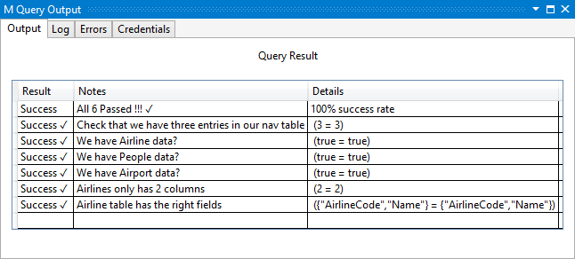
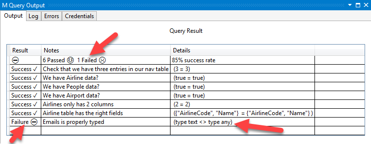
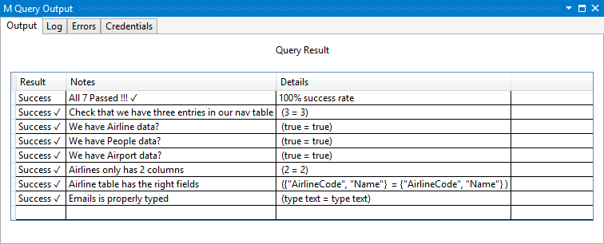

# TripPin Part 7 - Advanced Schema with M Types

This multi-part tutorial covers the creation of a new data source extension for Power Query. The tutorial is meant to be done sequentially � each lesson builds on the connector created in previous lessons, incrementally adding new capabilities to your connector. 

In this lesson, you will:

* Enforce a table schema using [M Types](https://msdn.microsoft.com/library/mt809131.aspx)
* Set types for nested records and lists
* Refactor code for reuse and unit testing

In the previous lesson we defined our table schemas using a simple "Schema Table" system.
This schema table approach works for many REST APIs/Data Connectors, but services that return complete
or deeply nested data sets might benefit from the approach in this tutorial, which leverages
the [M type system](https://msdn.microsoft.com/library/mt809131.aspx).

This lesson will guide you through the following steps:

1. Adding unit tests
2. Defining custom M types
3. Enforcing a schema using types
4. Refactoring common code into separate files 

## Adding Unit Tests
Before we start making use of the advanced schema logic, we will add a set of unit tests to our connector
to reduce the chance of inadvertently breaking something. Unit testing works like this:

1. Copy the common code from the [UnitTest sample](../../UnitTesting) into our `TripPin.query.pq` file
2. Add a section declaration to the top of our `TripPin.query.pq` file
3. Create a *shared* record (called `TripPin.UnitTest`)
4. Define a `Fact` for each test
5. Call `Facts.Summarize()` to run all of the tests
6. Reference the previous call as the shared value to ensure that it gets evaluated when the project is run in Visual Studio

```
section TripPinUnitTests;

shared TripPin.UnitTest =
[
    // Put any common variables here if you only want them to be evaluated once
    RootTable = TripPin.Contents(),
    Airlines = RootTable{[Name="Airlines"]}[Data],
    Airports = RootTable{[Name="Airports"]}[Data],
    People = RootTable{[Name="People"]}[Data],

    // Fact(<Name of the Test>, <Expected Value>, <Actual Value>)
    // <Expected Value> and <Actual Value> can be a literal or let statement
    facts =
    {
        Fact("Check that we have three entries in our nav table", 3, Table.RowCount(RootTable)),
        Fact("We have Airline data?", true, not Table.IsEmpty(Airlines)),
        Fact("We have People data?", true, not Table.IsEmpty(People)),
        Fact("We have Airport data?", true, not Table.IsEmpty(Airports)),
        Fact("Airlines only has 2 columns", 2, List.Count(Table.ColumnNames(Airlines))),        
        Fact("Airline table has the right fields",
            {"AirlineCode","Name"},
            Record.FieldNames(Type.RecordFields(Type.TableRow(Value.Type(Airlines))))
        )
    },

    report = Facts.Summarize(facts)
][report];
```

Clicking run on the project will evaluate all of the Facts, and give us a report output that looks like this:



Using some principles from [test-driven development](https://en.wikipedia.org/wiki/Test-driven_development),
we'll add a test that currently fails, but will soon implement/fix (by the end of this tutorial).
Specifically, we'll add a test that checks one of the nested records (Emails) we get back in the People entity.

```
Fact("Emails is properly typed", type text, Type.ListItem(Value.Type(People{0}[Emails])))
```

If we run the code again, we should now see that we have a failing test.



Now we just need to implement the functionality to make this work.

## Defining Custom M Types
The schema enforcement approach in the [previous lesson](../6-Schema/) used "schema tables" defined as Name/Type pairs.
It works well when working with flattened/relational data, but didn't support setting types on nested records/tables/lists, or allow you to reuse type definitions across tables/entities. 

In the TripPin case, the data in the People and Airports entities contain structured columns, and even share a type (Location) for representing address information.
Rather than defining Name/Type pairs in a schema table, we'll define each of these entities using custom M type declarations. 

Here is a quick refresher about types in the M language from the [Language Specification](https://msdn.microsoft.com/library/mt807488.aspx):

>A **type value** is a value that **classifies** other values. A value that is classified by a type is said to **conform** to that type. The M type system consists of the following kinds of types:
>* Primitive types, which classify primitive values (`binary`, `date`, `datetime`, `datetimezone`, `duration`, `list`, `logical`, `null`, `number`, `record`, `text`, `time`, `type`) and also include a number of abstract types (`function`, `table`, `any`, and `none`)
>* Record types, which classify record values based on field names and value types
>* List types, which classify lists using a single item base type
>* Function types, which classify function values based on the types of their parameters and return values
>* Table types, which classify table values based on column names, column types, and keys
>* Nullable types, which classifies the value null in addition to all the values classified by a base type
>* Type types, which classify values that are types

Using the raw json output we get (and/or looking up the definitions in the [service's $metadata](http://services.odata.org/v4/TripPinService/$metadata)), we can define the following record types to represent OData complex types:

```
LocationType = type [
    Address = text,
    City = CityType,
    Loc = LocType
];

CityType = type [
    CountryRegion = text,
    Name = text,
    Region = text
];

LocType = type [
    #"type" = text,
    coordinates = {number},
    crs = CrsType
];

CrsType = type [
    #"type" = text,
    properties = record
];
```

Note how the `LocationType` references the `CityType` and `LocType` to represented its structured columns.

For the top level entities (that we want represented as Tables), we define _table types_:

```
AirlinesType = type table [
    AirlineCode = text,
    Name = text
];

AirportsType = type table [
    Name = text,
    IataCode = text,
    Location = LocationType
];

PeopleType = type table [
    UserName = text,
    FirstName = text,
    LastName = text,
    Emails = {text},
    AddressInfo = {nullable LocationType},
    Gender = nullable text,
    Concurrency = Int64.Type
];
```

We then update our `SchemaTable` variable (which we use as a "lookup table" for entity to type mappings) to use these new type definitions:

```
SchemaTable = #table({"Entity", "Type"}, {
    {"Airlines", AirlinesType },    
    {"Airports", AirportsType },
    {"People", PeopleType}    
});
```

## Enforcing a Schema Using Types
We will rely on a common function (`Table.ChangeType`) to enforce a schema on our data, much like we used `SchemaTransformTable` in the [previous lesson](../6-Schema/).
Unlike `SchemaTransformTable`, `Table.ChangeType` takes in an actual M table type as an argument, and will apply our schema _recursively_ for all nested types. It's signature looks like this:

```
Table.ChangeType = (table, tableType as type) as nullable table => ...
```

The full code listing for the `Table.ChangeType` function can be found in the [Table.ChangeType.pqm](Table.ChangeType.pqm) file.

>**Note:** For flexibility, the function can be used on tables, as well as lists of records (which is how tables would be represented in a JSON document).

We then need to update the connector code to change the `schema` parameter from a `table` to a `type`, and add a call to `Table.ChangeType` in `GetEntity`. 

```
GetEntity = (url as text, entity as text) as table => 
    let
        fullUrl = Uri.Combine(url, entity),
        schema = GetSchemaForEntity(entity),
        result = TripPin.Feed(fullUrl, schema),
        appliedSchema = Table.ChangeType(result, schema)
    in
        appliedSchema;
```

`GetPage` is updated to use the list of fields from the schema (to know the names of what to expand when we get the results), but leaves the actual schema enforcement to `GetEntity`.

```
GetPage = (url as text, optional schema as type) as table =>
    let
        response = Web.Contents(url, [ Headers = DefaultRequestHeaders ]),        
        body = Json.Document(response),
        nextLink = GetNextLink(body),
        
        // If we have no schema, use Table.FromRecords() instead
        // (and hope that our results all have the same fields).
        // If we have a schema, expand the record using its field names
        data =
            if (schema <> null) then
                Table.FromRecords(body[value])
            else
                let
                    // convert the list of records into a table (single column of records)
                    asTable = Table.FromList(body[value], Splitter.SplitByNothing(), {"Column1"}),
                    fields = Record.FieldNames(Type.RecordFields(Type.TableRow(schema))),
                    expanded = Table.ExpandRecordColumn(asTable, fields)
                in
                    expanded
    in
        data meta [NextLink = nextLink];
```

### Confirming that nested types are being set
The definition for our `PeopleType` now sets the `Emails` field to a list of text (`{text}`).
If we are applying the types correctly, the call to [Type.ListItem](https://msdn.microsoft.com/library/mt260965) in our unit test should now be returning `type text` rather than `type any`. 

Running our unit tests again show that they are now all passing.



## Refactoring Common Code into Separate Files 
>**Note:** The M engine will have improved support for referencing external modules/common code in the future,
but this approach should carry you through until then.

At this point our extension almost has as much "common" code as TripPin connector code.
In the future these [common functions](../../../docs/helper-functions.md) will either be part of the built-in standard function library, or you will be able to reference them from another extension.
For now, we refactor our code in the following way:

1. Move the reusable functions to separate files (.pqm)
2. Set the **Build Action** property on the file to **Compile** to make sure it gets included in our extension file during the build
3. Define a function to load the code using [Expression.Evaluate](https://msdn.microsoft.com/library/mt260970.aspx)
4. Load each of the common functions we want to use

The code to do this is included in the snippet below:

```
Extension.LoadFunction = (name as text) =>
    let
        binary = Extension.Contents(name),
        asText = Text.FromBinary(binary)
    in
        Expression.Evaluate(asText, #shared);

Table.ChangeType = Extension.LoadFunction("Table.ChangeType.pqm");
Table.GenerateByPage = Extension.LoadFunction("Table.GenerateByPage.pqm");
Table.ToNavigationTable = Extension.LoadFunction("Table.ToNavigationTable.pqm");
```

## Conclusion
This tutorial made a number of improvements to the way we enforce a schema on the data we get from a REST API.
The connector is currently hard coding its schema information, which has a performance benefit at runtime, but is unable to adapt to changes in the service's metadata overtime. 
Future tutorials will move to a purely dynamic approach that will infer the schema from the service's $metadata document. 

In addition to the schema changes, this tutorial added Unit Tests for our code, and refactored the common helper functions into separate files to improve overall readability. 
