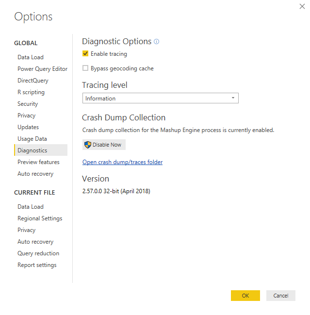
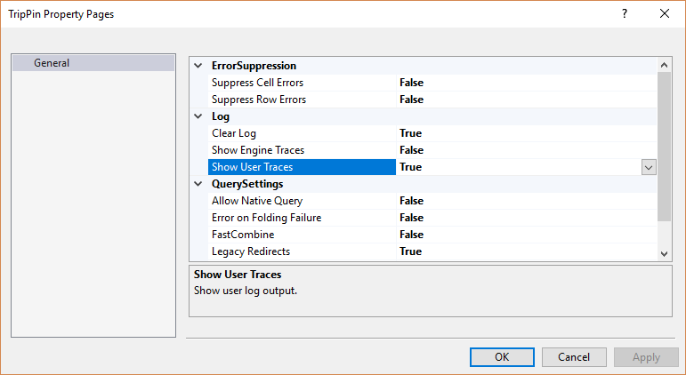
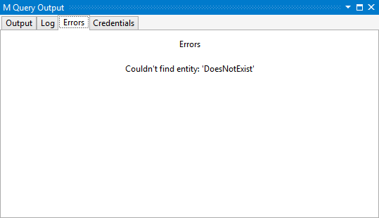
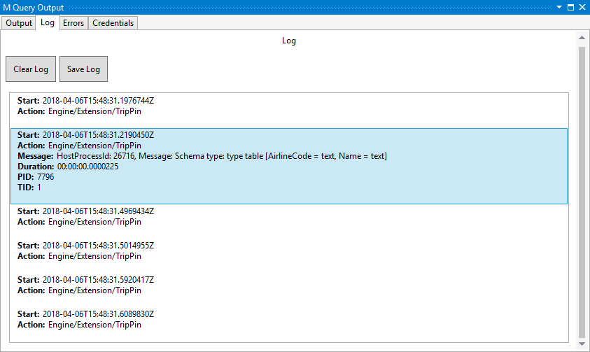

# TripPin Part 8 - Adding Diagnostics

This multi-part tutorial covers the creation of a new data source extension for Power Query. The tutorial is meant to be done sequentially - each lesson builds on the connector created in previous lessons, incrementally adding new capabilities to your connector.

In this lesson, you will:

* Learn about the [Diagnostics.Trace](https://msdn.microsoft.com/query-bi/m/diagnostics-trace) function
* Use the Diagnostics helper functions to add trace information to help debug your connector

## Enabling Diagnostics

Power Query users can enable trace logging by clicking the checkbox under **Options | Diagnostics**.



Once enabled, any subsequent queries will cause the M engine to emit trace information to log files located in a fixed user directory.

When running M queries from within the Power Query SDK, tracing is enabled at the project level. On the project properties page, there are three settings related to tracing:

1. **Clear Log**: when this is set to `true`, the log will be reset/cleared when you run your queries. I recommend you keep this set to `true`.
2. **Show Engine Traces**: this setting controls the output of built-in traces from the M engine. These traces are generally only useful to members of the Power Query team, so you'll typically want to keep this set to `false`.
3. **Show User Traces**: this setting controls trace information output by your connector. You'll want to set this to `true`.



Once enabled, you'll start seeing log entries in the M Query Output window, under the Log tab.

## Diagnostics.Trace

The [Diagnostics.Trace](https://msdn.microsoft.com/query-bi/m/diagnostics-trace) function is used to write messages into the M engine's trace log. 

```
Diagnostics.Trace = (traceLevel as number, message as text, value as any, optional delayed as nullable logical as any) => ...
```

>*An important note*: M is a functional language with lazy evaluation. When using `Diagnostics.Trace`, keep in mind that the function will only be called
> if the expression its a part of is actually evaluated. Examples of this can be found later in this tutorial.

The `traceLevel` parameter can be one of the following values (in descending order):

* `TraceLevel.Critical`
* `TraceLevel.Error`
* `TraceLevel.Warning`
* `TraceLevel.Information`
* `TraceLevel.Verbose`

When tracing is enabled, the user can select the maximum level of messages they would like to see. All trace messages of this level and under will be output to the log. For example, if the user selects the "Warning" level, trace messages of `TraceLevel.Warning`, `TraceLevel.Error`, and `TraceLevel.Critical` would appear in the logs.

The `message` parameter is the actual text that will be output to the trace file. Note that the text will not contain the `value` parameter, unless you explicitly include it in the text.

The `value` parameter is what the function will return. When the `delayed` parameter is set to `true`, `value` will be a zero parameter function which returns the actual value you are evaluating. When `delayed` is set to `false`, `value` will be the actual value. An example of how this works can be [found below](#delayed_evaluation).

### Using Diagnostics.Trace in the TripPin connector

For a practical example of using [Diagnostics.Trace](https://msdn.microsoft.com/query-bi/m/diagnostics-trace), and the impact of the `delayed` parameter, update the TripPin connector's `GetSchemaForEntity` function to wrap the `error` exception:

```
GetSchemaForEntity = (entity as text) as type =>
    try
        SchemaTable{[Entity=entity]}[Type]
    otherwise
        let
            message = Text.Format("Couldn't find entity: '#{0}'", {entity})
        in
            Diagnostics.Trace(TraceLevel.Error, message, () => error message, true);
```

We can force an error during evaluation (for test purposes!) by passing an invalid entity name to the `GetEntity` function. Here we change the `withData` line in the `TripPinNavTable` function, replacing `[Name]` with `"DoesNotExist"`.

```
TripPinNavTable = (url as text) as table =>
    let
        // Use our schema table as the source of top level items in the navigation tree
        entities = Table.SelectColumns(SchemaTable, {"Entity"}),
        rename = Table.RenameColumns(entities, {{"Entity", "Name"}}),
        // Add Data as a calculated column
        withData = Table.AddColumn(rename, "Data", each GetEntity(url, "DoesNotExist"), type table),
        // Add ItemKind and ItemName as fixed text values
        withItemKind = Table.AddColumn(withData, "ItemKind", each "Table", type text),
        withItemName = Table.AddColumn(withItemKind, "ItemName", each "Table", type text),
        // Indicate that the node should not be expandable
        withIsLeaf = Table.AddColumn(withItemName, "IsLeaf", each true, type logical),
        // Generate the nav table
        navTable = Table.ToNavigationTable(withIsLeaf, {"Name"}, "Name", "Data", "ItemKind", "ItemName", "IsLeaf")
    in
        navTable;
```

[Enable tracing](#enabling_diagnostics) for your project, and run your test queries. On the `Errors` tab you should see the text of the error you raised:



And on the `Log` tab, you should see the same message. Note that if you use different values for the `message` and `value` parameters, these would be different.


Also note that the `Action` field of the log message contains the name (Data Source Kind) of your extension (in this case, `Engine/Extension/TripPin`). This makes it easier to find the messages related to your extension when there are multiple queries involved and/or system (mashup engine) tracing is enabled.

### Delayed evaluation

As an example of how the `delayed` parameter works, we'll make some modifications and run the queries again.

First, set the `delayed` value to `false`, but leave the `value` parameter as-is:

```
Diagnostics.Trace(TraceLevel.Error, message, () => error message, false);
```

When you run the query, you'll receive an error that "We cannot convert a value of type Function to type Type", and not the actual error you raised. This is because the call is now returning a `function` value, rather than the value itself.

Next, remove the function from the `value` parameter:

```
Diagnostics.Trace(TraceLevel.Error, message, error message, false);
```

When you run the query, you'll receive the correct error, but if you check the Log tab, there will be no messages. This is because the `error` ends up being raised/evaluated _during_ the call to `Diagnostics.Trace`, so the message is never actually output.

> Now that you understand the impact of the `delayed` parameter, be sure to reset your connector back to a working state before proceeding.

## Diagnostic helper functions in Diagnostics.pqm

The [Diagnostics.pqm](Diagnostics.pqm) file included in this project contains a number of helper functions that make tracing easier. As shown in the [previous tutorial](7-AdvancedSchema#refactoring-common-code-into-separate-files), we can include this file in our project (remembering to set the Build Action to *Compile*), and then load it in our connector file. The bottom of our connector file should now look something like the code snippet below. Feel free to explore the various functions this module provides, but in this sample, we'll only be using the `Diagnostics.LogValue` and `Diagnostics.LogFailure` functions.

```
// Diagnostics module contains multiple functions. We can take the ones we need.
Diagnostics = Extension.LoadFunction("Diagnostics.pqm");
Diagnostics.LogValue = Diagnostics[LogValue];
Diagnostics.LogFailure = Diagnostics[LogFailure];
```

### Diagnostics.LogValue

The `Diagnostics.LogValue` function is a lot like `Diagnostics.Trace`, and can be used to output the value of what you evaluating.

```
Diagnostics.LogValue = (prefix as text, value as any) as any => ...
```

The `prefix` parameter is prepended to the log message. You'd use this to figure out which call output the message. The `value` parameter is what the function will return, and will also be written to the trace as a text representation of the M value. For example, if `value` is equal to a `table` with columns A and B, the log will contain the equivalent `#table` representation: `#table({"A", "B"}, {{"row1 A", "row1 B"}, {"row2 A", row2 B"}})`

>*Note*: Serializing M values to text can be an expensive operation. Be aware of the potential size of the values you are outputting to the trace.
>*Note*: Most Power Query environments will truncate trace messages to a maximum length.

As an example, we'll update the `TripPin.Feed` function to trace the `url` and `schema` arguments passed into the function.

```
TripPin.Feed = (url as text, optional schema as type) as table =>
    let
        _url = Diagnostics.LogValue("Accessing url", url),
        _schema = Diagnostics.LogValue("Schema type", schema),
        //result = GetAllPagesByNextLink(url, schema)
        result = GetAllPagesByNextLink(_url, _schema)
    in
        result;
```

Note that we have to use the new `_url` and `_schema` values in the call to `GetAllPagesByNextLink`. If we used the original function parameters, the `Diagnostics.LogValue` calls would never actually be evaluated, resulting in no messages written to the trace. _Functional programming is fun!_

When we run our queries, we should now see new messages in the log.

Accessing url:


Schema type:


Note that we see the serialized version of the `schema` parameter `type`, rather than what you'd get when you do a simple Text.FromValue() on a type value (which results in "type").

### Diagnostics.LogFailure

The `Diagnostics.LogFailure` function can be used to wrap function calls, and will only write to the trace if the function call fails (i.e. returns an `error`).

```
Diagnostics.LogFailure = (text as text, function as function) as any => ...
```

Internally, `Diagnostics.LogFailure` adds a `try` operator to the `function` call. If the call fails, the `text` value is written to the trace before returning the original `error`. If the `function` call succeeds, the result is returned without writing anything to the trace. Since M errors don't contain a full stack trace (i.e. you typically only see the message of the error), this can be useful when you want to pinpoint where the error was actually raised.

As a (poor) example, we'll modify the `withData` line of the `TripPinNavTable` function to force an error once again:

```
withData = Table.AddColumn(rename, "Data", each Diagnostics.LogFailure("Error in GetEntity", () => GetEntity(url, "DoesNotExist")), type table),
```

In the trace, we can find the resulting error message containing our `text`, and the original error information.


Be sure to reset your function to a working state before proceeding with the next tutorial.

## Conclusion

This brief (but important!) lesson showed you how to make use of the diagnostic helper functions to log to the Power Query trace files.
When used properly, these functions are extremely useful in debugging issues within your connector.

>*Note:* As a connector developer, it is your responsibility to ensure that you do not log sensitive or personally identifiable information (PII)
> as part of your diagnostic logging. You must also be careful to not output too much trace information, as it can have a negative performance impact.