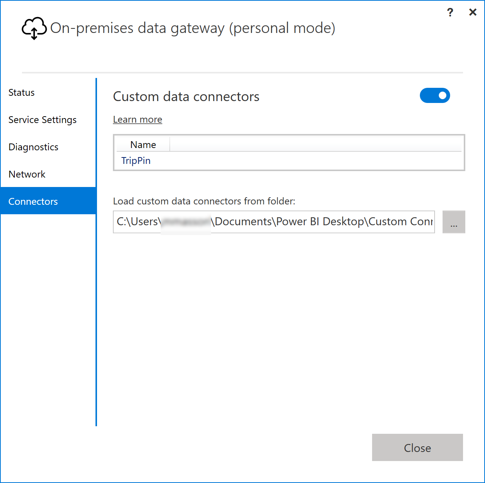
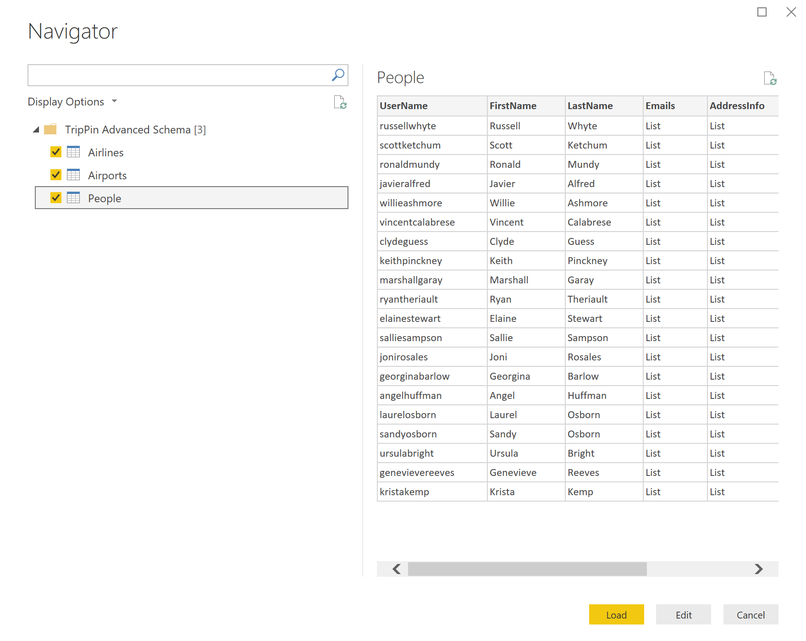
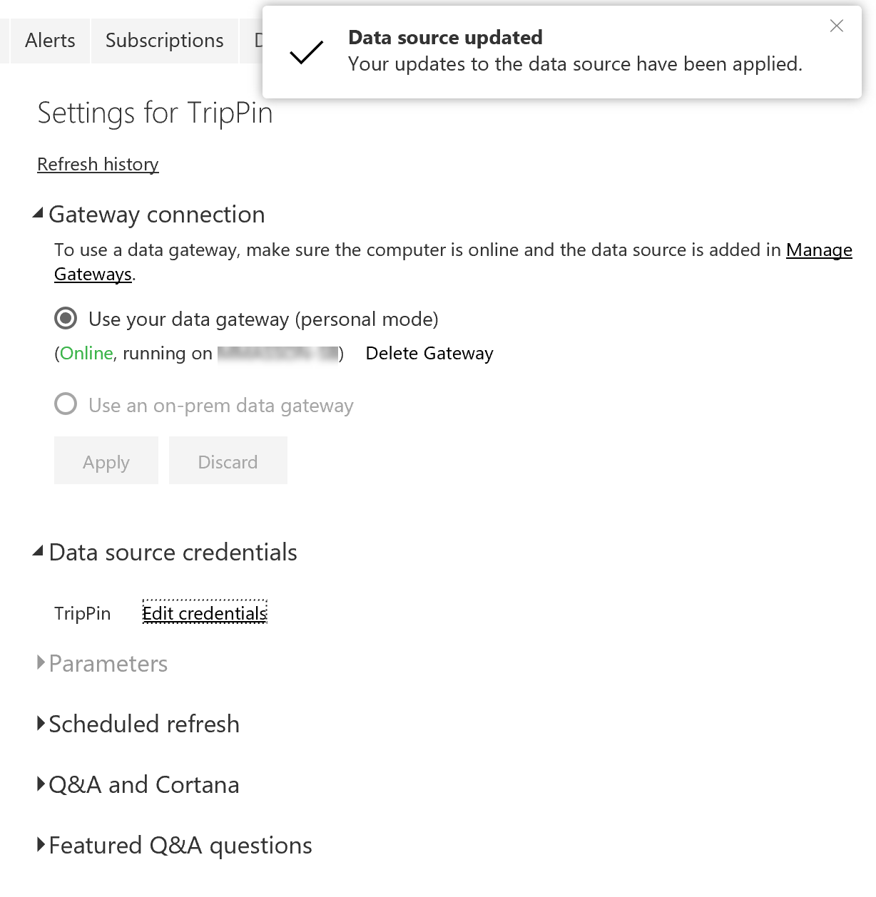

# TripPin Part 9 - TestConnection

This multi-part tutorial covers the creation of a new data source extension for Power Query. The tutorial is meant to be done sequentially - each lesson builds on the connector created in previous lessons, incrementally adding new capabilities to your connector.

In this lesson, you will:

* Add a TestConnection handler
* Configure the Power BI On-Premises Data Gateway (Personal mode)
* Test scheduled refresh through the Power BI service

Custom Connector support was added to the April 2018 release of the [Personal On-Premises Gateway](https://docs.microsoft.com/en-us/power-bi/service-gateway-onprem#install-the-gateway-in-personal-mode).
This new (preview) functionality allows for Scheduled Refresh of reports that make use of your custom connector. 

The tutorial will cover the process of enabling your connector for refresh, and a quick walkthrough of the steps of configuring the gateway. Specifically you will:

1. Add a TestConnection handler to your connector
2. Install the Power BI On-Premises Data Gateway in Personal mode
3. Enable Custom Connector support in the Gateway
4. Publish a workbook that uses your connector to PowerBI.com
5. Configure scheduled refresh to test your connector

Please see the [technical documentation](../../../docs/m-extensions.md) for more information on the [TestConnection handler](../../../docs/m-extensions.md#implementing-testconnection-for-gateway-support).

## Background

There are three prerequisites for configuring a data source for scheduled refresh via PowerBI.com:

1. **The data source is supported:** This means that the target gateway environment is aware of all of the functions contained within the query you want to refresh.
2. **Credentials are provided:** To present the right credential entry dialog, Power BI needs to know the support authentication mechanism for a given data source.
3. **The credentials are valid:** After the user provides credentials, they are validated by calling the data source's `TestConnection` handler. 

The first two items are handled by registering your connector with the gateway.
When the user attempts to configure scheduled refresh in PowerBI.com, the query information is sent to your personal gateway to determine if any data sources that aren't recognized by the Power BI service (i.e. custom ones that you created) are available there.
The third item is handled by invoking the TestConnection handler defined for your data source.

## Adding a TestConnection Handler

The TestConnection handler is added to the Data Source Kind declaration record (the same place you declare its supported authentication type(s)).
The handler is a `function` with a single parameter of type `any`, which returns a `list`.
The first value in the list is the function that will be called to actually test the connection. This is generally the same as your main data source function.
In some cases you may need to expose a separate `shared` function to provide an efficient connection test, however, this should generally be avoided.

Since the TripPin data source function has no required arguments, the implementation for TestConnection is fairly simple:

```
// Data Source Kind description
TripPin = [
    // TestConnection is required to enable the connector through the Gateway
    TestConnection = (dataSourcePath) => { "TripPin.Contents" },
    Authentication = [
        Implicit = []
    ],
    Label = "TripPin Part 9 - TestConnection"
];
```

> Future versions of the Power Query SDK will provide a way to validate the TestConnection handler from Visual Studio. Currently, the only mechanism that uses TestConnection is the On-premises Data Gateway.

## Enabling Custom Connectors in the Personal Gateway

> **Reminder:** Custom Connector support is currently in Preview, and requires the April 2018 or later version of the gateway, installed in Personal Mode.

Download and install the [Power BI On-Premises Data Gateway](https://powerbi.microsoft.com/en-us/gateway/). When you run the installer, select the Personal Mode.

After installation is complete, launch the gateway and sign into Power BI. The sign-in process will automatically register your gateway with the Power BI services. Once signed in, perform the following steps:

1. Click on the _Connectors_ tab
2. Click the switch to enable support for **Custom data connectors**
3. Select the directory you wish to load custom connectors from. This will usually be the same directory that you'd use for Power BI Desktop, but the value is configurable. 
4. The page should now list all extension files in your target directory 



Please see the [online documentation](https://docs.microsoft.com/en-us/power-bi/service-gateway-onprem#install-the-gateway-in-personal-mode) for more information about the gateway. 

## Testing Scheduled Refresh

Open Power BI Desktop and create a report that imports data using the TripPin connector. 



Add one or more visuals to your report page (optional), and then publish the report to PowerBI.com.

After publishing, go to PowerBI.com and find the dataset for the report you just published. Click the ellipses, and select _Schedule Refresh_. Expand the _Gateway connection_ and _Data source credentials_ sections.


> **Note:** If the dataset configuration page says that the report contains unknown data sources, your gateway/custom connector may not be configured properly. Go to the personal gateway configuration UI and make sure that there are no errors next to the TripPin connector. You may need to restart the gateway (on the _Service Settings_ page) to pick up the latest configuration.

Click on the _Edit credentials_ link to bring up the authentication dialog, and click sign-in.

> **Note:** If you receive an error similar to the one below ("Failed to update data source credentials"), you most likely have an issue with your TestConnection handler. 


After a successful call to TestConnection, the credentials will be accepted. You can now schedule refresh, or click on the dataset ellipse and select "Refresh Now". You can click on the _Refresh history_ link to view the status of the refresh (which generally takes a few minutes to get kicked off).



## Conclusion

Congratulations! You now have a production ready custom connector that supported automated refresh through the Power BI service. 
