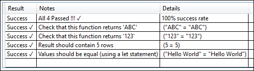
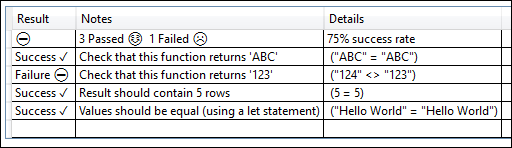

# Unit Testing Sample
This sample shows how you can add simple unit testing to your `<extension>.query.pq file`. 

Each test is defined as a `Fact` that has a name, an expected value, and an actual value.
In most cases, the "actual value" will be an M expression that tests part of your extension. 

In this sample, our extension exports three simple functions:

```
section UnitTesting;

shared UnitTesting.ReturnsABC = () => "ABC";
shared UnitTesting.Returns123 = () => "123";
shared UnitTesting.ReturnsTableWithFiveRows = () => Table.Repeat(#table({"a"},{{1}}), 5);
```

Our unit test code is made up of a number of Facts, and a bunch of common code for the unit test framework (`ValueToText`, `Fact`, `Facts`, `Facts.Summarize`). The following code provides an example set of Facts - please see the [UnitTesting.query.pq](UnitTesting.query.pq) file for the common code.

```
section UnitTestingUnitTests;

shared MyExtension.UnitTest =
[
    // Put any common variables here if you only want them to be evaluated once

    // Fact(<Name of the Test>, <Expected Value>, <Actual Value>)
    facts =
    {        
        Fact("Check that this function returns 'ABC'",  // name of the test
             "ABC",                                     // expected value
             UnitTesting.ReturnsABC()                   // expression to evaluate (let or single statement)
        ),
        Fact("Check that this function returns '123'",
             "123",                                   
             UnitTesting.Returns123()
        ),
        Fact("Result should contain 5 rows",
            5,
            Table.RowCount(UnitTesting.ReturnsTableWithFiveRows())
        ),
        Fact("Values should be equal (using a let statement)",
            "Hello World",
            let
                a = "Hello World"
            in
                a
        )
    },

    report = Facts.Summarize(facts)
][report];
```

Running the sample in Visual Studio gives you a visual summary of the pass rates:



Here is an example with a forced failure:


